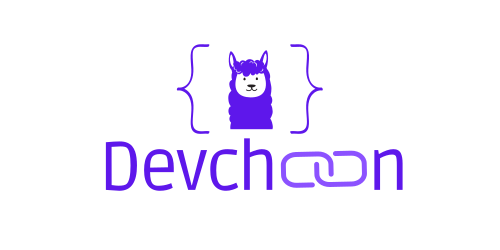

<div align="center">



🧑‍💻⛓️ DevChain
==============================

🚀 Use LLM to prototype, build and understand the creation of your applications 🚀

</div>

## 🔥 What ? 

**DevChain** is an AI powered application that helps you build software by providing code. It relies on a multi-agent system to simulate the developpment life cycle, following more or less the Scrumban methodology. It is built on top of the [Langchain](https://www.langchain.com/) framework. Each agent of the system will be powered and simulated by a Large Language Model (LLM).

### Important

**Devchain** was thought to be a **Supercharged** coding assistant, not exactly a "Software engineer". It is meant to help developers accelerate their own workflows, by providing a load of comprehensive and adaptated document to better understand the initial idea. It is supposed to help developers to prototype and develop faster by providing reasoned code.

### **Example of project created with devchain** :

**Initial prompt** : Create a web application that shows the statistics of a github repository in PYTHON. Include the HMTL and CSS code DIRECTLY inside of the python code by using a string TEMPLATE variable. (deprecated)
It was generated with only **gpt-4**.

https://github.com/mantucorp/devchain/assets/92988093/142825f5-866f-499b-b929-9963e5403435


**Initial prompt** : Snake game in python using pygame. The game should feature a green snake with a red food. Divide the screen into a grid and consider that one cell is the size of a segment of the snake and the size of a food. (up to date)
It was generated with only **gpt-4**.

https://github.com/mantucorp/devchain/assets/92988093/bed6c5f9-2198-417c-905e-4ad3e332cfb6


<!-- Create a simple web application using python that generates random quotes and renders them in cards on the window. It needs to use Flask for the backend and HTML and Tailwind CSS for the front-end. Keep it very simple but put an emphasize on the appearance of the web app. The UI should be inspired by the apple.com UI design.

Simple pong game in python using pygame. The game should include an AI that will be the opponent of the player. Use the default font of pygame for any text oriented task.

Tic tac toe web application in python. The front-end should use HTML, Tailwind(CSS) and the back-end shoukd use python and flask. Keept the application simple. The tic-tac-toe game should come with a user-friendly web interface, allowing two players to take turns and determining the winner.

A web application to compare the star histories of two githug repositories. The application plots the star histories of the two repos. The application should be implemented in python with flask. Use Tailwind to style the front-end of the application. The plot should be created on the frontend of the application with a javascript library. 

A Sentiment analysis web application. It should take as input some text from the user and output if the input is negative, positive or neutral with the corresponding percentage. The backend should use python and fastapi to create a REST API. The app should include an endpoint to analyze the sentiment of a text via Roberta model used directly via huggingface/transformers. The application should include an app.py file that directly starts the FastAPI app via uvicorn. The backend should serve/render directly the front-end application built with Html, javascript and styled with tailwindcss. The UI should have a similar style as the UI from ChatGPT. The title of the application should be styled in big at the top-center, the text area should be in the bottom center and the results should appear dynamically in the center of the window.


Design and develop a login and registration page using Bootstrap included via CDN. Implement interactivity between the pages. Store the data in the local storage without using a backend. The whole logic should be done using HTML, CSS, and JavaScript but use python and flask ONLY to render the front-end. Ensure that the page is aesthetically pleasing and responsive. Do not use frameworks like Vue or React. Consider including features such as login success and registration message notifications. Aim to provide users with a simple, enjoyable, and visually attractive experience.
-->

## ⚙️ How it works ?

**Devchain** simulating a whole development team in the background. Each agent is powered by the LLM of your choice.
At the moment, a team follow a simple process :
1. The **user** sends an application request.
2. The **Product owner** writes the backlog of that application : user stories + requirements.
3. The **user** selects the ones he wants to keep.
4. The **project manager** writes a description of the application.
5. The **software architect** create the architecture of the application : stack, class diagram, file list, common interface.
6. The **Tech lead** plans the coding session.
7. The **Developer** writes the code by following the tasks from the coding plan.
8. The **Tester** design the testscases.(optional)
9. The **Tech lead** plans test writting session.(optional)
10. The **Tester** writes the test by follow the tasks from the test plan.(optional)
8. The **Senior Developer** starts his own workflow:
    -   He runs the code
    -   He runs the tests
    -   He asks for a feedback
    -   Selects the files to review (code and tests)
    -   He reviews the files and give a list of fixes
    -   He adjust the fixes.

9. The **Developer** corrects the code.
10. The **tester** corrects the tests.(optional)

## Features

### 🎮 Control over the process

The idea behin that application is to help the developer, not to replace him, so the developer has the control over the whole process.
**Devchain** let you *in control* of the whole process by involving you in the process and by allowing you to modify the produced documents. That complements the LLMs lack of sense and guide them toward the development.

**Devchain** give you the possibility *to select* the LLMs that you need for your system. This allows the possibility to connect differenct models with each one having its specialization.
You also have control over the number of iterations of the system.

**Devchain** provides with the *code*, a lot of *documentation* that helps building the app but especially help the user to have a deep understanding of the functioning of the application.
This include the global information about the project and the architecture of the application. The goal is to encourage the developer to debug the code and understand the idea behind it to code it itself.

### 🤖 LLM freedom of reasoning

The idea of **Devchain** is to let the LLMs design and code freely and so provide a great base to developers. This freedom allows the AI to code as *natural* as possible, like a real developer would do. This also allow the LLMs to fully exploit the data that it acquired during its training. The application only guides the AI through the process by indicating the tasks, but the AI decides on everything thanks to its reasoning capabilities. This includes the entire design of the application, the code implementation, the code context or even the debugging. The Human is here to understand and exploit the ideas from the AI for his own project and to help it to go as far as possible. 

### 🧪 Test workflow

An idea that came out when creating the app was to *automate* the debugging process by directly incorporating the tests in the Senior dev workflow. The goal was to allow the AI to have a deeper understanding of the state of the application by running the tests. On the paper, that idea seemed to be a good idea, but in practice it was not. The testing workflow was quite similar to the development one : the tester designs the testcases, the tech lead plans the test writting.
The big problem with incorporating the test workflow is that it obviously **multiply the problem by 2** : 2 times more code to debug, with one being already complicated.
So the workflow is accessible as optional, but it can be interesting to have a good starting points.

### ⛏️ Code selection and extraction

To enhance the code generation, we implemented a *Code selection and extraction* component, it's called the CodeContextRetriever. The idea is simple : the LLM chooses the code that is needed for a specific task or fix and the retriever directly extract it from the codebase. The Selection relies on the LLM reasoning capacities to ask for the right code in the right format : **file::class::function** (the class and function level can be removed depending on the LLM choice). This allows to reduce the tokens consumption and optimize the result.
The CodeContextRetriever build the ast of the code to extract the precise code bodies and associate them with the right keywords. At the moment, the system supports python and Javascript at the function level and any other language at the file level.

## 🔨 Install 

Working on **python 3.11.7** and **Ubuntu 22**.

Install dependecies :
```sh
pip install -r requirements.txt
```

To run the application you need to add a .env file in the repository folder. 
It should contain :
- the Azure Openai variables if you plan to use Azure Openai,
- Hugging face vaariables, if chosen
- Langchain API support if wanting to use with Langsmith

**example:**
```sh
# Hugging face 
HUGGINGFACEHUB_API_TOKEN="************************************"
TAVILY_API_KEY="********************************"

# Azure Openai 
OPENAI_API_TYPE='azure'
OPENAI_API_VERSION='2023-07-01-preview'
OPENAI_API_KEY='****************************************'

# GPT3.5
AZURE_OPENAI_ENDPOINT_35='*******************/gpt-35-turbo/chat/completions?api-version=2023-07-01-preview'

# GPT4
AZURE_OPENAI_ENDPOINT_4='************************************************/gpt4/chat/completions?api-version=2023-07-01-preview'

# Langchain API
LANGCHAIN_TRACING_V2=true
LANGCHAIN_API_KEY='******************'
LANGCHAIN_ENDPOINT='https://api.smith.langchain.com'
```

You can modify directly the parameters of the application directly from the [config.yaml file](./config/config.yaml).

Command:
```sh
python3 main.py
```

## Devchain's Workflow


If you want to know more about the application architecture check [here](./ressources/Architecture.md)


