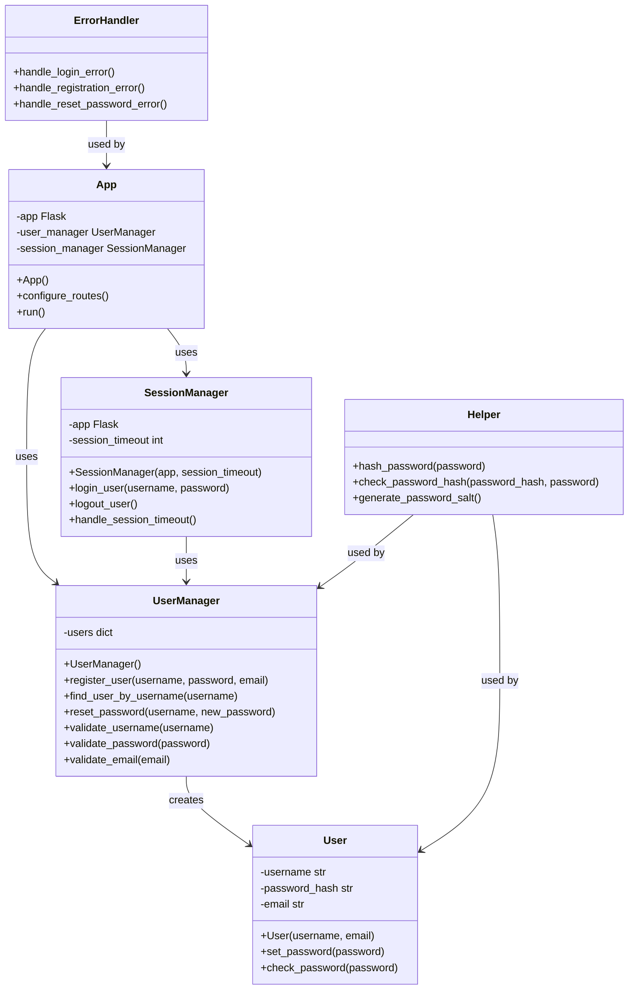

# Architecture and design
## Stack selection
Language: Python
Libraries: [Flask, Flask-Session, Werkzeug, itsdangerous, email-validator]
Description: Python is chosen for its simplicity and readability, which is ideal for web application development. Flask is a lightweight WSGI web application framework that is easy to get started with and scales up to complex applications. Flask-Session is an extension for Flask that adds support for server-side session to your application. Werkzeug is a comprehensive WSGI web application library that Flask is based upon, which includes utilities for password hashing and secure password storage. Itsdangerous is used to securely sign data to ensure its integrity. Email-validator is used to validate email addresses.

## Design
The software design will consist of the following components:
1. App: The entry point of the application, responsible for initializing the Flask app and configuring routes and session management.
2. User: Represents a user, handling user-related data and operations such as registration, authentication, and password management.
3. SessionManager: Manages user sessions, including login, logout, and session timeout features.
4. UserManager: Manages user-related operations, including user registration, password reset, and user validation.
5. ErrorHandler: Handles error reporting and user notifications without exposing sensitive information or system details.
6. Helper: Provides utility functions for password hashing, salting, and validation of user input.

## Class diagram

In this revised design, the `App` class is responsible for initializing the Flask application, setting up routes, and running the server. The `User` class encapsulates user data and provides methods for password management. The `SessionManager` class handles session-related functionality, including login, logout, and session timeouts. The `UserManager` class is responsible for user registration, password resets, and user validation. The `ErrorHandler` class provides methods for handling errors in a secure manner. The `Helper` class provides utility functions for password hashing and salting. The `users` attribute in the `UserManager` class is a map that stores usernames and user objects in memory.

Changes made to the design:
- The `UserManager` class now includes a method `validate_email` to ensure that email validation is part of the user management responsibilities.
- The `SessionManager` class's `login_user` method now takes `username` and `password` as parameters instead of a `User` object to decouple session management from the user object.
- The `User` class's constructor now takes `username` and `email` as parameters, and the `password` is set using the `set_password` method to separate the concerns of user creation and password management.
- The `Helper` class no longer has a `validate_email` method as this responsibility has been moved to the `UserManager` class.
- The `ErrorHandler` class is used by the `App` class to handle errors across the application.
- The `SessionManager` class now uses the `UserManager` class to validate user credentials during login.

## Files list
[helper.py, user.py, user_manager.py, session_manager.py, error_handler.py, templates/login.html, templates/register.html, templates/dashboard.html, templates/forgot_password.html, app.py]

- helper.py (contains Helper class): Provides utility functions for password hashing, salting, and validation of user input. This is the foundational class that supports secure password management and should be implemented first.

- user.py (contains User class): Represents a user and handles user-related data and operations such as setting and checking passwords. This class relies on the Helper class for password management.

- user_manager.py (contains UserManager class): Manages user-related operations, including user registration, password reset, and user validation. It uses the User class to create and manage user objects and the Helper class for password validation.

- session_manager.py (contains SessionManager class): Manages user sessions, including login, logout, and session timeout features. It interacts with the UserManager class to validate user credentials during login.

- error_handler.py (contains ErrorHandler class): Handles error reporting and user notifications without exposing sensitive information or system details. This class is used across the application to provide secure and informative error messages to the user.

- templates/login.html: The HTML template for the login page. It contains the form fields for username and password and the login button.

- templates/register.html: The HTML template for the registration page. It contains the form fields for username, password, and email, as well as the register button.

- templates/dashboard.html: The HTML template for the secure dashboard area. It includes the logout option and other user-specific information and controls.

- templates/forgot_password.html: The HTML template for the password reset page. It contains the form for requesting a password reset and may include fields for email verification or security questions.

- app.py (contains App class): The entry point of the application, responsible for initializing the Flask app, configuring routes, and running the server. It uses the UserManager and SessionManager classes to handle user registration, login, and session management, and the ErrorHandler class to manage errors. This file also sets up the Flask app's configuration, including session management with Flask-Session. It should be implemented last as it brings together all the other components.

## Common interface
### Routes
- `/register`: Handles the user registration process.
- `/login`: Handles the user login process.
- `/logout`: Handles the user logout process.
- `/dashboard`: Serves the secure dashboard area after successful login.
- `/forgot_password`: Handles the password reset process.

### Variables and form
- `username`: A form field variable for the user's username.
- `password`: A form field variable for the user's password.
- `email`: A form field variable for the user's email (used in registration and password reset).
- `error_message`: A variable to display error messages to the user.
- `session_timeout_alert`: A variable to notify the user before automatic logout due to inactivity.

### Dependencies
- `app.py`: Depends on `user_manager.py`, `session_manager.py`, `error_handler.py`, and Flask-related libraries.
- `user.py`: Depends on `helper.py` for password hashing and checking.
- `user_manager.py`: Depends on `user.py` and `helper.py` for user creation and password validation.
- `session_manager.py`: Depends on `user_manager.py` for user credential validation.
- `error_handler.py`: No direct dependencies, but provides interfaces for `app.py` to handle errors.
- `helper.py`: No direct dependencies, provides utility functions for password management.

### CSS classes
- `.form-input`: Styles form input fields such as username, password, and email.
- `.form-button`: Styles buttons like login, register, and reset password.
- `.error-message`: Styles error message text to make it noticeable, typically with a red color.
- `.dashboard-area`: Styles the secure dashboard area where the user interacts after login.
- `.logout-button`: Styles the logout button within the dashboard area.
- `.timeout-alert`: Styles the session timeout notification alert.
- `.forgot-password-link`: Styles the "Forgot Password" link on the login page.