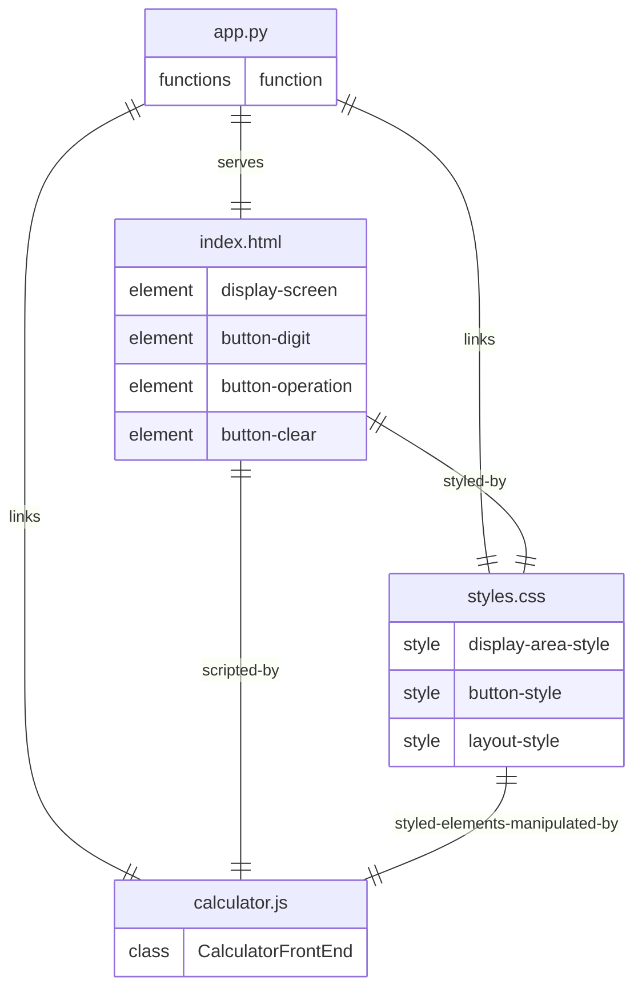

# Architecture
## Stack
```yaml
backend:
    languages: python
    libraries:
        - flask
frontend:
    languages:
        - javascript
        - css
        - html
    libraries:
        javascript:
            - none
        css:
            - none
        html:
            - none
```

## File list
Based on the provided specifications and user stories, here is a list of code files that will be written by the development team for the QuickCalc Web application:

- /app.py: This file is the entry point of the Flask application. It sets up the Flask server, routes for the web application, and serves the main HTML page for the calculator.

- /static/styles.css: This CSS file contains all the styling rules for the calculator's front-end, ensuring a visually appealing and modern design as per the requirements. It will define styles for the display area, buttons, and overall layout.

- /templates/index.html: This HTML file serves as the main template for the QuickCalc Web application. It includes the structure of the calculator, such as the display screen, buttons for digits and operations, and the clear button.

- /static/calculator.js: This JavaScript file contains the logic for the calculator's front-end. It handles user interactions with the calculator buttons, performs arithmetic operations, updates the display in real-time, and resets the state of the calculation when the clear button is pressed.

These files encapsulate the main features of the QuickCalc Web application, including rendering the user interface, handling user input, and performing calculations. They are designed to be simple, with a clear separation of concerns, and to have real utility in the context of the application's requirements.

## Roles
Based on the context provided, here is a detailed description of each file, their roles, and how they interact with each other within the QuickCalc Web application:

* `app.py`:
    - This file is the backbone of the Flask application, responsible for initializing and running the web server.
    - It contains functions to define routes that serve the HTML template and link the CSS and JavaScript files.
    - It should instantiate the Flask app, define route(s) for serving `index.html`, and link `styles.css` and `calculator.js` so they are accessible to the client's browser.
    - It does not directly interact with the front-end logic but provides the necessary endpoints for the front-end to function.

* `static/styles.css`:
    - Contains the styling rules for the QuickCalc Web application's user interface.
    - Defines the visual aspects of the calculator, such as the layout, colors, fonts, button styles, and display area.
    - It is linked to the HTML elements in `index.html` and provides the visual styling that `calculator.js` will manipulate when updating the display or indicating button presses.
    - It is served by `app.py` and applied to the HTML content when the page is rendered in the browser.

* `templates/index.html`:
    - Serves as the main HTML template for the QuickCalc Web application.
    - Contains the structural markup for the calculator, including the display screen, digit buttons, operation buttons, and the clear button.
    - It includes the `calculator.js` script for dynamic functionality and the `styles.css` file for styling.
    - The content of this file is served by `app.py` when a user accesses the web application.

* `static/calculator.js`:
    - Implements the front-end logic for the calculator.
    - Contains a class or functions that handle user interactions with the calculator's buttons, perform arithmetic operations, and update the display in real-time.
    - It is responsible for resetting the state of the calculation when the clear button is pressed.
    - It manipulates the HTML elements defined in `index.html` and is influenced by the styles defined in `styles.css`.
    - This file is linked to `index.html` and is served by `app.py` to provide interactivity to the web application.

The Entity Relationship Diagram (ERD) illustrates the relationships between these files. `app.py` serves as the central node that connects to all other files, indicating its role in serving the front-end resources. `index.html` is the structural foundation that is styled by `styles.css` and made interactive by `calculator.js`. The `styles.css` and `calculator.js` files have a bidirectional relationship, indicating that the JavaScript manipulates elements that are styled by the CSS.

In summary, `app.py` sets up the server and serves the front-end files, `index.html` provides the HTML structure, `styles.css` applies the visual design, and `calculator.js` adds interactivity and handles the calculator's logic. Each file has a distinct role, ensuring a clear separation of concerns and facilitating an efficient and performant application design.

## Entity relationship diagram
Based on the context provided, here is the detailed Entity Relationship Diagram (ERD) that describes the architecture of the code files that are part of the QuickCalc Web application, including their relationships and the summary of the back and front end designs:



### Explanation:

- **app.py**: This is the Flask application file that serves as the entry point. It initializes the server, sets up routes, and serves the main HTML page. It contains functions to perform these tasks.

- **index.html**: This is the main HTML template for the QuickCalc Web application. It includes the necessary HTML elements such as the display screen for showing the current operation and result, buttons for digits, operations, and a clear button.

- **styles.css**: This CSS file contains the styling rules for the QuickCalc Web application. It defines styles for the display area, buttons, and the overall layout to ensure a visually appealing interface.

- **calculator.js**: This JavaScript file contains the front-end logic for the calculator. It includes a class that handles user interactions, performs arithmetic operations, updates the display in real-time, and resets the state of the calculation when the clear button is pressed.

The ERD reflects the separation of concerns, with the back-end (Flask) serving the front-end files, and the front-end (HTML, CSS, JavaScript) handling the user interface and interactions. The CSS file is linked to the HTML elements it styles, and the JavaScript file manipulates the HTML elements and is influenced by the CSS styles.

