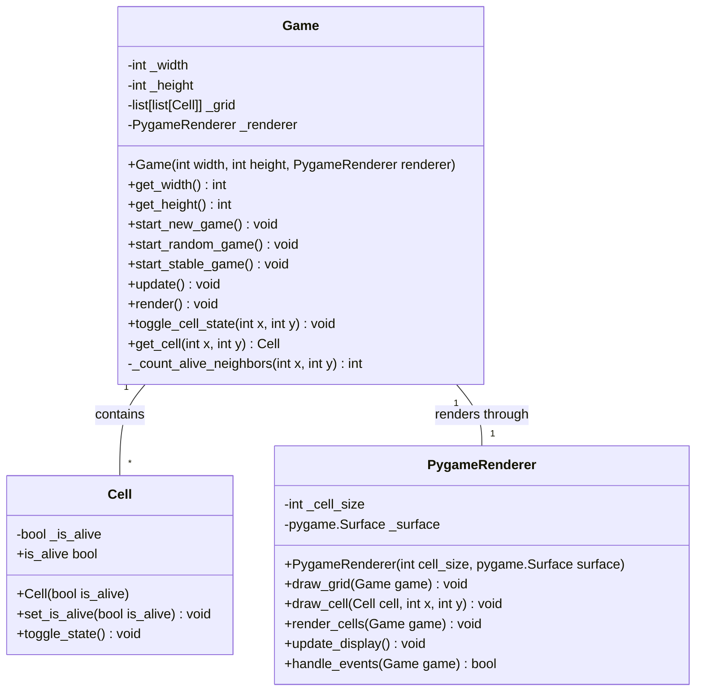

# Architecture
## Stack
```yaml
backend:
    languages: python
    libraries:
        - pygame
frontend:
    languages: python
    libraries:
        - pygame
```
## Class diagram

## Front-end design
The application does not require a front-end, render directly in the back-end using the suited library.

## File list
Here is the list of files that the development team will need to write for the implementation of the LifeCraft: The Cellular Automaton Explorer application, following the provided technical stack and architecture:

- /app.py (contains the main entry point): This file is the entry point of the application. It will initialize the game, handle the game loop, and integrate the Pygame library for rendering. It should contain the main function to start the game and manage the high-level control flow.

- /game/game.py (contains Game class): This file defines the Game class, which will manage the state of the cellular automaton, including the grid of cells and the game's width and height. It will contain methods to start a new game, update the game state, render the game, toggle the state of individual cells, and retrieve cell information.

- /game/cell.py (contains Cell class): This file will define the Cell class, representing each cell in the cellular automaton grid. It will contain methods to set and get the alive state of the cell and toggle its state.

- /rendering/pygame_renderer.py (contains PygameRenderer class): This file will define the PygameRenderer class, which will be responsible for drawing the game grid and individual cells on the screen using Pygame. It will contain methods to draw the grid, draw individual cells, and handle user input events.

Each of these files will contain Python code and will utilize the Pygame library for rendering as specified in the technical stack. The codebase will be modular, with each class in its own file, to ensure clean and maintainable code.

