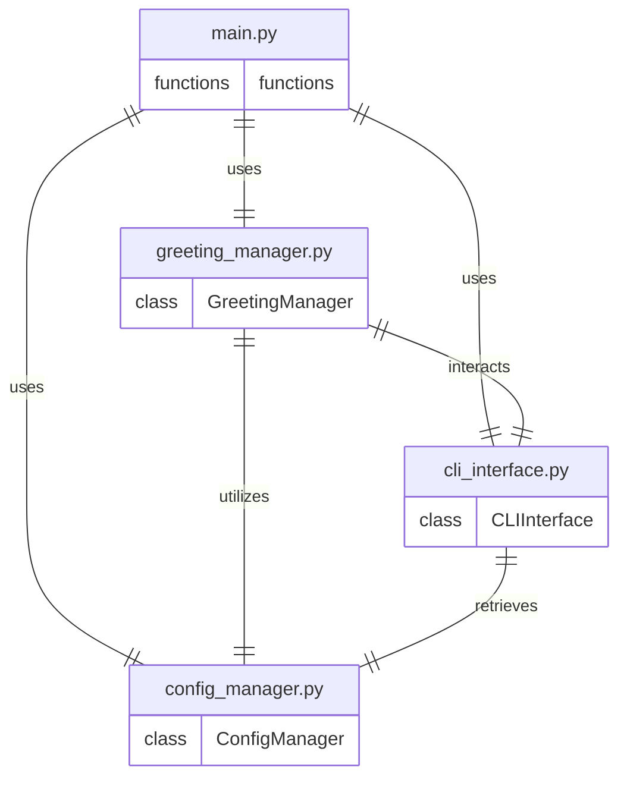

# Architecture
## Stack
```yaml
backend:
    languages: python
    libraries:
        - argparse
        - sys
frontend:
    languages: python
    libraries: []
```

## File list
Based on the provided user stories, requirements, and technical stack, the following code files will be necessary for the PyHelloWorld application:

- **/main.py**: This file is the entry point of the application. It will parse command-line arguments using the `argparse` library, handle user interactions, and coordinate the flow of the application according to the user's inputs and the application's logic.

- **/greeting_manager.py**: This file contains the `GreetingManager` class that manages the greeting logic, including prompting the user for their name, generating the greeting message, and displaying it to the user.

- **/cli_interface.py**: This file defines the `CLIInterface` class that handles the command-line interface elements, such as displaying prompts, instructions, help messages, and handling graceful exits from the application.

- **/config_manager.py**: This file includes the `ConfigManager` class that manages the application's configuration settings, such as loading and parsing a configuration file or environment variable to customize the greeting message.

Each of these files serves a distinct purpose in the application, ensuring that the codebase is modular and maintainable. The division of responsibilities aligns with the user stories and requirements, facilitating an organized development process and a quality final product.

## Roles
Based on the provided context, here is the description of each file and class within the MergeMaster 2048 application, following the format provided:

* `/main.py`:
    - Serves as the entry point of the application.
    - Parses command-line arguments and coordinates the application flow.
    - Instantiates and uses `GreetingManager`, `CLIInterface`, and `ConfigManager` to handle user interactions and application logic.
    - Main functions may include `parse_arguments()`, `main()`, and `exit_application()`.

* `/greeting_manager.py`:
    - Contains the `GreetingManager` class responsible for the greeting logic.
    - Interacts with `CLIInterface` to prompt the user for their name and display the greeting.
    - Utilizes `ConfigManager` to retrieve and apply custom greeting settings.
    - Key methods might include `prompt_name()`, `generate_greeting()`, and `display_greeting()`.

* `/cli_interface.py`:
    - Defines the `CLIInterface` class that manages the command-line interface.
    - Provides user prompts, instructions, help messages, and handles graceful exits.
    - Retrieves configuration settings from `ConfigManager` to customize the CLI experience.
    - Important methods could be `display_prompt()`, `show_help()`, and `handle_exit()`.

* `/config_manager.py`:
    - Includes the `ConfigManager` class for managing application configuration.
    - Loads and parses configuration from a file or environment variable.
    - Provides an interface for other classes to access configuration settings.
    - Essential methods may include `load_config()`, `get_setting()`, and `parse_environment_variables()`.

The relationships between these files and classes are as follows:

- `main.py` is the orchestrator and uses the other classes to create a cohesive application flow.
- `GreetingManager` in `greeting_manager.py` relies on `CLIInterface` to interact with the user and `ConfigManager` to customize greetings.
- `CLIInterface` in `cli_interface.py` uses `ConfigManager` to tailor the CLI based on user preferences or default settings.
- `ConfigManager` in `config_manager.py` is a utility class that is used by both `GreetingManager` and `CLIInterface` to access and apply configurations.

The technical stack for this application is Python 3, and the application is designed to run in a command-line interface (CLI). The application's packaging should allow for easy installation and execution across different operating systems that support Python. The design ensures that each class and file has a clear responsibility, promoting maintainability and facilitating the implementation of the user stories and requirements.

## Entity relationship diagram


In this ERD, each entity represents a Python file within the PyHelloWorld application. The relationships indicate how these files interact with each other:

- `main.py` uses the `GreetingManager`, `CLIInterface`, and `ConfigManager` to orchestrate the application's flow.
- `greeting_manager.py` interacts with `cli_interface.py` to prompt the user and display messages, and it utilizes `config_manager.py` to customize the greeting message.
- `cli_interface.py` retrieves configuration settings from `config_manager.py` to display appropriate prompts and messages to the user.

Each file is designed to encapsulate a specific aspect of the application, ensuring a clear separation of concerns and facilitating maintainability and scalability.

