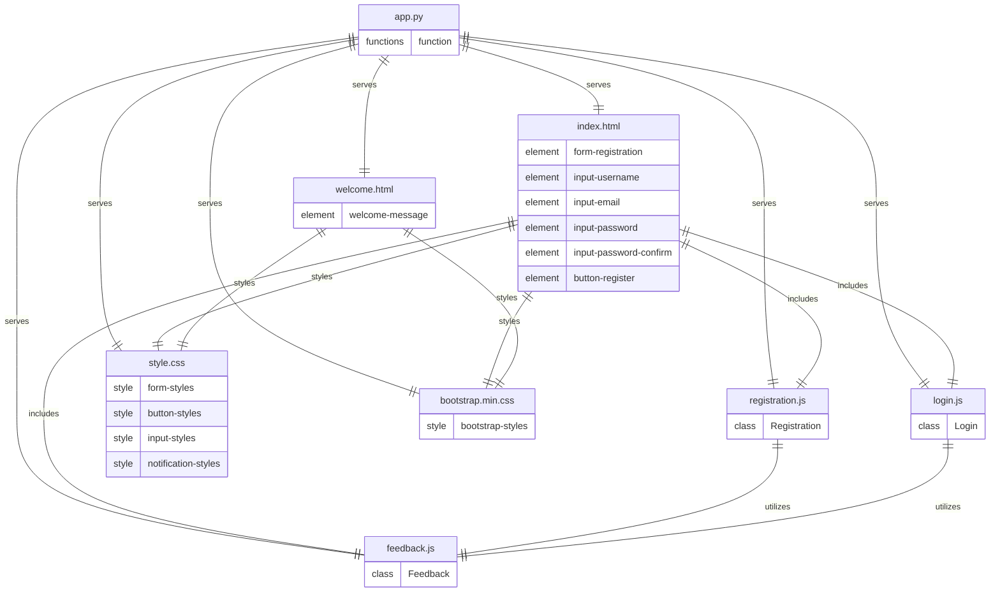

# Architecture
## Stack
```yaml
backend:
    languages: python
    libraries:
        - flask
frontend:
    languages:
        - javascript
        - css
        - html
    libraries:
        javascript:
            - none
        css:
            - bootstrap
        html:
            - none
```

## File list
- /app.py: This file is the entry point of the Flask application. It sets up the Flask server, routes for the registration and login pages, and serves the static files (HTML, CSS, JavaScript).

- /templates/index.html: This HTML file serves as the landing page that includes the registration and login forms. It uses Bootstrap for styling and responsiveness.

- /templates/welcome.html: This HTML file is the welcome page that users see upon successful login. It also uses Bootstrap for consistent styling.

- /static/js/registration.js: This JavaScript file contains the logic for handling user registration, including form validation, storing credentials in local storage, and displaying success or error messages.

- /static/js/login.js: This JavaScript file manages the login process, including form validation, credential verification from local storage, and redirection to the welcome page or displaying error messages.

- /static/js/feedback.js: This JavaScript file is responsible for displaying visual feedback to the user, such as success notifications and error messages during login and registration actions.

- /static/css/style.css: This CSS file defines the custom styles for the application, ensuring a visually attractive interface with a consistent color scheme and typography, while complementing Bootstrap's styles.

- /static/css/bootstrap.min.css: This file is the minified version of Bootstrap's CSS, included via CDN, to provide styling and responsiveness to the application's interface.

## Roles
* `/app.py`:
    - This file is the entry point of the Flask application and is responsible for initializing the Flask server.
    - It defines routes for the registration and login pages and serves the static files and templates.
    - It serves the static JavaScript files (`registration.js`, `login.js`, `feedback.js`), CSS files (`style.css`, `bootstrap.min.css`), and HTML templates (`index.html`, `welcome.html`).
    - It does not contain any back-end logic as per the product owner's requirements, focusing solely on rendering the front-end.

* `/templates/index.html`:
    - This HTML file is the landing page of the application, containing the registration and login forms.
    - It includes the JavaScript files `registration.js`, `login.js`, and `feedback.js` for handling user interactions.
    - It is styled by `style.css` for custom styles and `bootstrap.min.css` for Bootstrap styles, ensuring a consistent and responsive design.
    - The form elements within this file (`input-username`, `input-email`, `input-password`, `input-password-confirm`, `button-register`) are manipulated by the included JavaScript files.

* `/templates/welcome.html`:
    - This HTML file is the welcome page displayed to users after a successful login.
    - It is styled by `style.css` and `bootstrap.min.css` to maintain a consistent look and feel with the rest of the application.
    - The `welcome-message` element is a placeholder for personalized user messages or additional content.

* `/static/js/registration.js`:
    - Contains the `Registration` class which encapsulates the logic for user registration.
    - It handles form validation, storing user credentials in local storage, and interacts with `feedback.js` to display success or error messages.
    - It is included in `index.html` and directly manipulates the DOM elements related to registration.

* `/static/js/login.js`:
    - Contains the `Login` class which manages the login process.
    - It validates the login form, verifies credentials from local storage, and handles redirection to the welcome page or error messaging.
    - It utilizes the `Feedback` class from `feedback.js` to provide visual feedback to the user and is included in `index.html`.

* `/static/js/feedback.js`:
    - Contains the `Feedback` class responsible for displaying visual feedback to the user.
    - It is used by both `registration.js` and `login.js` to show success notifications and error messages.
    - It manipulates the DOM to provide real-time feedback based on user actions.

* `/static/css/style.css`:
    - Defines custom styles for the application, including form, button, input, and notification styles.
    - It ensures that the application has a visually attractive interface with a consistent color scheme and typography.
    - It complements the Bootstrap styles and is included in both `index.html` and `welcome.html`.

* `/static/css/bootstrap.min.css`:
    - This is the minified version of Bootstrap's CSS, included via CDN as per the product owner's requirements.
    - It provides the base styling and responsiveness for the application's interface.
    - It is included in both `index.html` and `welcome.html` to style the HTML elements consistently across the application.

## Entity relationship diagram


This ERD represents the architecture of the SecureVault application, detailing the relationships between the various code files. Each entity represents a file, and the relationships indicate how these files interact with each other. The ERD also summarizes the front-end design by listing the HTML elements and CSS styles that need to be written.

