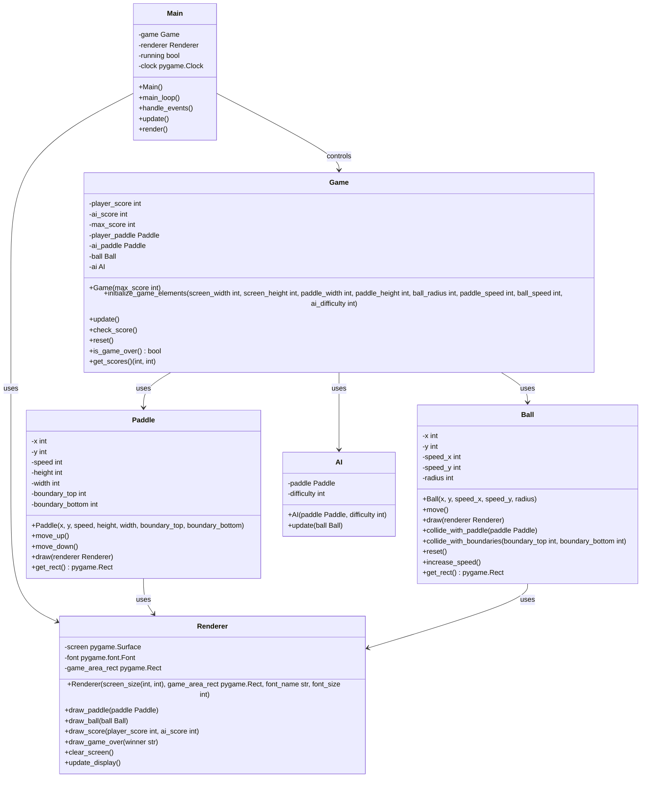

# Architecture and design
## Stack selection
Language: Python
Libraries: [pygame]
Description: Python is chosen for its simplicity and readability, which is ideal for a small game project. Pygame is a set of Python modules designed for writing video games and provides the necessary functionality for graphics and handling user input, making it suitable for implementing the game's graphical interface.

## Design
The software design will consist of the following components:
1. Main: The entry point of the application, responsible for initializing the game and managing the game loop.
2. Paddle: Represents a player's paddle, handling its movement and collision detection.
3. Ball: Represents the game ball, handling its movement and collision detection with paddles and game area boundaries.
4. AI: Represents the AI opponent, controlling the movement of the AI paddle.
5. Game: Manages the game state, including the score, win/loss conditions, and game restarts.
6. Renderer: Handles the rendering of the game elements and the display of the score and game over message.

## Class diagram

In this revised design, the `Main` class is responsible for the main game loop, handling events, updating game state, and rendering. The `Paddle` class represents the player's paddle and handles movement and collision detection. The `Ball` class represents the game ball and handles movement, collision detection, and rendering. The `AI` class represents the AI opponent and controls the AI paddle's movement. The `Game` class manages the game state, including the score and win/loss conditions. The `Renderer` class handles all rendering operations, including drawing paddles, the ball, the score, and the game over message.

Each class has been given clear responsibilities, and the class diagram has been updated to reflect the correct relationships and dependencies between classes. The design is now consistent and solid for implementation, with each class being implementable independently.

## Files list
[renderer.py, paddle.py, ball.py, ai.py, game.py, main.py]

- renderer.py (contains Renderer class): This class is responsible for all rendering operations in the game, such as drawing the paddles, the ball, the score, and the game over message. It also handles screen updates and clearing. This should be implemented first as it provides the visual feedback necessary for the rest of the game's development.

- paddle.py (contains Paddle class): This class defines the paddle object, including its properties like position and speed, and methods for movement (up and down). It also includes a method to draw the paddle using the Renderer, and collision detection with the ball.

- ball.py (contains Ball class): This class defines the ball object, including its properties like position, speed, and radius, and methods for movement and collision detection with paddles and boundaries. It also includes a method to draw the ball using the Renderer.

- ai.py (contains AI class): This class represents the AI opponent. It includes methods for updating the AI paddle's position based on the ball's movement and the selected difficulty level to ensure the game is engaging for the player.

- game.py (contains Game class): This class manages the game state, including initializing game elements, updating positions of the ball and paddles, keeping score, checking for win/loss conditions, and resetting the game when necessary.

- main.py (contains Main class): This is the entry point of the application. It initializes the game, manages the game loop, processes events, updates the game state, and delegates rendering to the Renderer class. This should be implemented last as it brings all the other components together to create the functioning game.

## Common interface
### Routes
- No specific routes as this is a standalone game application.

### Variables and form
- `key_input`: A variable that captures the keyboard input from the player to control the paddle movement.
- `player_score`: A variable that represents the current score of the player.
- `ai_score`: A variable that represents the current score of the AI opponent.
- `game_state`: A variable that represents the current state of the game, including whether it is running, paused, or over.
- `ai_difficulty`: A variable that represents the difficulty level of the AI opponent.
- `winner`: A variable that indicates the winner of the game, either "player" or "AI".

### Dependencies
- main.py: Depends on game.py and renderer.py to manage the game loop and rendering.
- paddle.py: Depends on renderer.py for drawing the paddle.
- ball.py: Depends on renderer.py for drawing the ball.
- ai.py: Depends on paddle.py for controlling the AI paddle.
- game.py: Depends on paddle.py, ball.py, and ai.py to manage the game state, score, and interactions between game objects.
- renderer.py: Depends on pygame for rendering and is used by main.py, paddle.py, and ball.py to draw game elements on the screen.

### CSS classes
- No CSS classes as Pygame handles the graphical interface directly without using CSS.