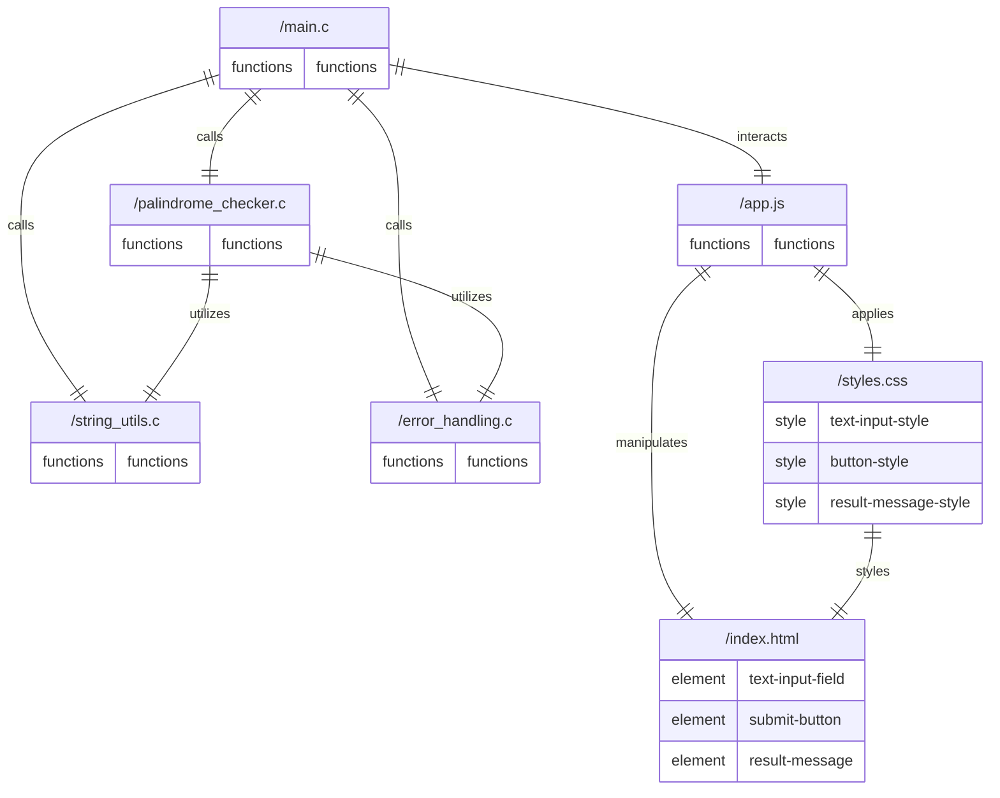

# Architecture
## Stack
```yaml
backend:
    languages: C
    libraries: []
frontend:
    languages:
        - javascript
        - css
        - html
    libraries:
        javascript:
            - axios
        css:
            - tailwind
        html:
            - bootstrap
```

## File list
Based on the provided context, here is a list of code files that will be written by the development team for the Palindrome Verifier Pro application:

- **/main.c**: This file is the entry point of the application. It will handle the command-line interface for inputting strings and displaying results. It will also coordinate the flow of the program, calling functions to normalize input and check for palindromes.

- **/palindrome_checker.c**: This file contains the logic to check if a given string is a palindrome. It will include a function that normalizes the input string by converting it to lowercase and removing spaces, punctuation, and special characters, as well as a function that determines if the normalized string is a palindrome.

- **/string_utils.c**: This file will include utility functions for string manipulation that are necessary for normalizing the input strings, such as removing unwanted characters and converting to lowercase.

- **/error_handling.c**: This file will define functions for error handling and providing clear error messages to the user for invalid inputs or unexpected situations.

- **/index.html**: The main HTML file that provides the structure for the frontend user interface. It will include a text input field and a submit button for users to enter strings they want to check.

- **/styles.css**: This CSS file will use Tailwind to style the frontend, ensuring the application is visually appealing and user-friendly.

- **/app.js**: This JavaScript file will handle the interaction between the frontend and the backend. It will use Axios to send the user's input to the backend and display the results returned by the backend.

- **/palindrome_service.c**: This optional file could act as a service layer between the main application logic and the palindrome checking functionality, providing a clear separation of concerns and potentially making it easier to extend the application in the future.

Each file will be well-documented with comments explaining the code and logic, as per the product owner's requirements. The C code will be optimized for performance to handle large strings efficiently.

## Roles
Based on the provided context, here is a breakdown of each file's role, their relationships, and the main features they will provide in the Palindrome Verifier Pro application:

* `/main.c`:
    - Serves as the entry point of the application.
    - Handles the command-line interface for inputting strings and displaying results.
    - Coordinates the flow of the program by calling functions from other files to normalize input and check for palindromes.
    - Interacts with `/app.js` to facilitate communication between the backend and the frontend.
    - Instantiates and utilizes functions from `/palindrome_checker.c`, `/string_utils.c`, and `/error_handling.c`.

* `/palindrome_checker.c`:
    - Contains the core logic to check if a given string is a palindrome.
    - Provides a function to normalize the input string (convert to lowercase, remove spaces, punctuation, and special characters).
    - Includes a function that determines if the normalized string is a palindrome.
    - Utilizes string manipulation functions from `/string_utils.c`.
    - Uses error handling functions from `/error_handling.c` to manage invalid inputs or unexpected situations.

* `/string_utils.c`:
    - Includes utility functions for string manipulation.
    - Functions are used for normalizing input strings by removing unwanted characters and converting to lowercase.
    - These utility functions are called by `/palindrome_checker.c` to prepare strings for palindrome checking.

* `/error_handling.c`:
    - Defines functions for error handling and providing clear error messages to the user.
    - These functions are used by `/main.c` and `/palindrome_checker.c` to handle invalid inputs or unexpected situations gracefully.

* `/index.html`:
    - Provides the structure for the frontend user interface.
    - Contains a text input field, a submit button, and an area to display results.
    - Interacts with `/app.js` which manipulates its content and is styled by `/styles.css`.

* `/styles.css`:
    - Uses Tailwind CSS to style the frontend elements.
    - Defines styles for the text input field, submit button, and result message area in `/index.html`.
    - Ensures the application is visually appealing and user-friendly.

* `/app.js`:
    - Handles the interaction between the frontend and the backend.
    - Uses Axios to send the user's input to the backend and display the results.
    - Manipulates the DOM elements defined in `/index.html` and applies styles from `/styles.css`.

* `/palindrome_service.c` (optional):
    - Acts as a service layer between the main application logic and the palindrome checking functionality.
    - Provides a clear separation of concerns and makes it easier to extend the application in the future.
    - Could be instantiated by `/main.c` to abstract the palindrome checking process.

The technical stack for this application consists of C for the backend logic, HTML/CSS for the frontend presentation, and JavaScript (with Axios for HTTP requests) for frontend-backend communication. The application is designed to be efficient and performant, with a focus on handling large strings and providing a user-friendly interface. Each file will be well-documented to ensure clarity and maintainability.

## Entity relationship diagram


This ERD represents the architecture of the Palindrome Verifier Pro application, summarizing the backend and frontend designs. Each entity represents a file in the application, and the relationships between these files are indicated by the connecting lines. The backend is primarily written in C, with `/main.c` serving as the entry point and coordinating the flow of the program. It calls functions from `/palindrome_checker.c`, `/string_utils.c`, and `/error_handling.c` to process the input and check for palindromes. The frontend is handled by `/app.js`, which interacts with the backend and manipulates the HTML elements defined in `/index.html`. The visual styles are applied through `/styles.css`.

