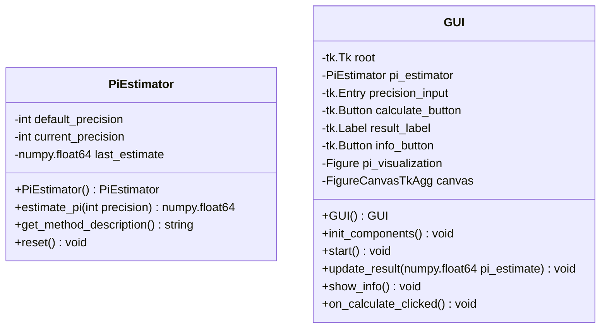

# Architecture
## Stack
Language: Python
Libraries:
  - tkinter
  - matplotlib
  - numpy

## Class diagram

This class diagram represents a simple and concise design for the PiQuest application, with clear relationships between the classes. The `App` class serves as the main entry point, containing instances of `PiEstimator` for the calculation logic and `GUI` for the user interface. The `GUI` class handles all user interactions and visualizations, while the `PiEstimator` class is responsible for the actual Pi estimation process. The `GUI` class can interact with the `PiEstimator` to initiate the estimation process and display results.
## File list
[app.py, pi_estimator.py, gui.py]

- app.py (contains App class): This is the entry point of the application. It initializes the PiEstimator and GUI classes, and contains the main loop to run the application. It orchestrates the interactions between the GUI and the Pi estimation logic.
  
- pi_estimator.py (contains PiEstimator class): This class is responsible for the mathematical estimation of Pi. It contains methods to estimate Pi to a specified precision, retrieve the description of the method used for estimation, and reset any stored values to ensure independent estimations.
  
- gui.py (contains GUI class): Manages the graphical user interface of the application. It initializes all the GUI components using tkinter, handles user interactions such as button clicks, and invokes the PiEstimator to calculate Pi when requested. It also updates the GUI with the results and information about the estimation method.

## Common interface
### Routes
- No specific routes as this is a standalone desktop application with no web server or API communication.

### Variables and forms
- `precision_input`: A tkinter Text widget variable that captures the user's desired precision level for the Pi estimation.
- `calculate_button`: A tkinter Button widget variable that triggers the Pi estimation process when clicked.
- `result_label`: A tkinter Label widget variable that displays the result of the Pi estimation.
- `info_button`: A tkinter Button widget variable that, when clicked, displays the method description or visualization.
- `pi_visualization`: A matplotlib Figure variable that may be used to visualize the algorithm used for Pi estimation.

### Dependencies
- app.py: Depends on pi_estimator.py for Pi calculation logic and gui.py for user interface management.
- pi_estimator.py: Depends on numpy for numerical computations.
- gui.py: Depends on tkinter for GUI components, matplotlib for visualizations, and pi_estimator.py for initiating Pi calculations and retrieving method descriptions.

### CSS classes
- Since the application uses tkinter for the GUI, which does not utilize CSS for styling, there are no CSS classes. Instead, tkinter properties and methods are used to style and manage the layout of the GUI components.