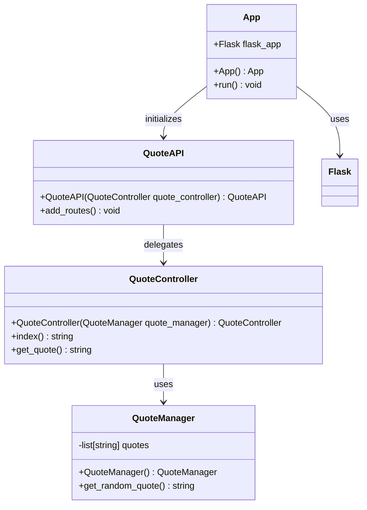

# Architecture
## Stack
backend:
    languages: python
    libraries:
        - flask
frontend:
    languages:
        - javascript
        - css
        - html
    libraries:
        javascript:
            - axios
        css:
            - tailwindcss

## Class diagram

## Front-end design
### HTML
The HTML structure will be composed of the following sections:

- **Main Quote Display Section**: This section will contain a card-like component that displays the inspirational quote. It will include a text element for the quote and another for the author, if available.
- **Button Section**: A section with an interactive button labeled "New Quote" that users can click to generate a new quote without refreshing the page.
- **Footer Section**: This will contain any footer content, such as copyright information or links to the application's repository or about page.

### CSS
The following styles should be implemented using Tailwind CSS classes to achieve a design similar to apple.com:

- `.quote-card`: This class will style the quote card component with a clean and modern design, using Tailwind CSS utilities for padding, margins, text alignment, shadows, and responsive design.
- `.quote-text`: Styles the text of the quote, ensuring it is prominent and easily readable.
- `.author-text`: Styles the author's name, if present, in a smaller font size than the quote text.
- `.new-quote-button`: Styles the "New Quote" button with Tailwind CSS utilities to make it stand out and be consistent with the overall design.
- `.footer`: Styles the footer section with a minimalistic design, possibly including a smaller font size and different text color.

### JavaScript
The JavaScript functions to be added to the project are:

- `fetchRandomQuote`: This function will send an asynchronous request to the server to fetch a new random quote. It will use the `axios` library to perform the AJAX request.
- `displayQuote`: This function will update the quote card's content with the new quote received from the server.
- `initializeQuote`: This function will be called on page load to fetch and display the initial random quote.
- `registerEventListeners`: This function will set up the event listener for the "New Quote" button, calling `fetchRandomQuote` when clicked.

The JavaScript code should be included in a separate `.js` file and linked in the HTML document within the `<head>` section using the `async` attribute to avoid blocking the rendering of the page.

### Integration
#### Routes
- `/`: GET request that serves the main page of the application with the quote card and "New Quote" button.
- `/quote`: GET request that fetches a new random quote from the server.

#### Templates Variables
- `quote`: A variable that contains the initial random quote to be displayed when the page loads.

### CDN Links and Library Integration
The following CDN links should be included in the `<head>` section of the HTML:

- Tailwind CSS: `<link href="https://cdn.jsdelivr.net/npm/tailwindcss@2.1.2/dist/tailwind.min.css" rel="stylesheet">`
- Axios: `<script src="https://cdn.jsdelivr.net/npm/axios/dist/axios.min.js"></script>`

These links will import Tailwind CSS for styling and Axios for making AJAX requests. They should be placed before any custom stylesheets or JavaScript files to ensure the libraries load first.

By following this design, the front-end will be well-structured, visually appealing, and functionally integrated with the back-end, ensuring a seamless user experience.

## File list
- /app.py (contains App class): This is the entry point of the application. It initializes the Flask application and sets up the routing using the QuoteAPI class.

- /quote_manager.py (contains QuoteManager class): Manages the collection of quotes and provides functionality to retrieve a random quote from the collection.

- /quote_controller.py (contains QuoteController class): Handles the incoming HTTP requests related to quotes. It uses the QuoteManager to get random quotes and returns them to the client.

- /quote_api.py (contains QuoteAPI class): Sets up the API routes for the Flask application, delegating the request handling to the QuoteController.

- /templates/index.html: The main HTML template for the web application. It includes the structure for the quote display, the "New Quote" button, and the footer section.

- /static/css/style.css: Contains the custom styles for the application, using Tailwind CSS classes to achieve the desired design similar to apple.com.

- /static/js/main.js: Contains the JavaScript functions for fetching a new quote using Axios, updating the quote display, and setting up event listeners for the "New Quote" button.

The structure of the application files should be as follows:

```
/app.py
/quote_manager.py
/quote_controller.py
/quote_api.py
/templates/
    index.html
/static/
    /css/
        style.css
    /js/
        main.js
```

Each file's role is described above, and they should contain the classes and structures as outlined in the design. The HTML, CSS, and JavaScript files are part of the front-end and are responsible for the presentation and interactivity of the web application. The Python files make up the back-end, handling data management, server logic, and API endpoints.

