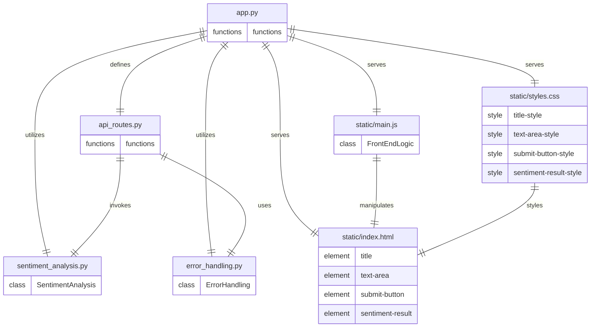

# Architecture
## Stack
```yaml
backend:
    languages: python
    libraries:
        - fastapi
        - uvicorn
        - transformers
frontend:
    languages:
        - javascript
        - css
        - html
    libraries:
        javascript: []
        css:
            - tailwindcss
        html: []
```

## File list
- /app.py: This file serves as the entry point for the FastAPI application. It includes the setup for the Uvicorn server, route definitions for the REST API, and configurations for serving the front-end static files.

- /sentiment_analysis.py: This file contains the SentimentAnalysis class that integrates the RoBERTa model from the Hugging Face `transformers` library. It handles the processing of input text and returns the sentiment analysis results.

- /api_routes.py: This file defines the API routes for the FastAPI application. It includes the endpoint for receiving text from the front-end, invoking the sentiment analysis, and returning the results in JSON format.

- /error_handling.py: This file includes the ErrorHandling class or functions that manage error responses for the API. It ensures that users receive appropriate feedback for issues such as invalid input or server errors.

- /static/index.html: This HTML file is the main page of the front-end application. It includes the structure for the user interface, with elements such as the application's title, text area for input, and a submit button.

- /static/styles.css: This file contains the TailwindCSS styling for the front-end application. It ensures that the UI is styled similarly to ChatGPT's UI and is responsive across different devices.

- /static/main.js: This JavaScript file manages the front-end logic, including event handlers for submitting text, making API requests using Axios, and dynamically displaying the sentiment analysis results on the page.

## Roles
* `/app.py`:
    - Serves as the entry point for the FastAPI application.
    - Sets up the Uvicorn server, which is an ASGI server implementation, to serve the application.
    - Defines the route configurations for the REST API, which are detailed in `/api_routes.py`.
    - Configures the application to serve static files such as `index.html`, `styles.css`, and `main.js`, enabling the backend to render the frontend.
    - Utilizes the `SentimentAnalysis` class from `/sentiment_analysis.py` to process sentiment analysis requests.
    - Utilizes error handling mechanisms defined in `/error_handling.py` to manage and respond to errors within the application.
    - The `app.py` file integrates with other components by instantiating and configuring them as part of the application setup.

* `/sentiment_analysis.py`:
    - Contains the `SentimentAnalysis` class which integrates the RoBERTa model from the Hugging Face `transformers` library.
    - Handles the processing of input text and returns sentiment analysis results.
    - The `SentimentAnalysis` class is instantiated and used by the API routes defined in `/api_routes.py` to perform sentiment analysis when the relevant endpoint is called.
    - The class should include methods to preprocess the text, predict sentiment, and format the results for the API response.

* `/api_routes.py`:
    - Defines the API routes for the FastAPI application.
    - Includes the endpoint for receiving text input from the frontend, which is then passed to the `SentimentAnalysis` class for processing.
    - Returns the sentiment analysis results in JSON format to the frontend.
    - Uses the `ErrorHandling` mechanisms from `/error_handling.py` to manage errors that may occur during the API request handling.
    - The API routes are defined within the context of the FastAPI application in `app.py`, and they interact with the sentiment analysis and error handling components.

* `/error_handling.py`:
    - Includes the `ErrorHandling` class or functions that manage error responses for the API.
    - Ensures that users receive appropriate feedback for issues such as invalid input or server errors.
    - The error handling mechanisms are used by the API routes in `/api_routes.py` to provide consistent and informative error responses.

* `/static/index.html`:
    - The main page of the frontend application.
    - Includes the structure for the user interface, with elements such as the application's title, text area for input, submit button, and area to display sentiment analysis results.
    - The content of this file is manipulated by the JavaScript logic defined in `/static/main.js`.
    - The styles from `/static/styles.css` are applied to the elements within this HTML file to ensure a consistent and responsive design.

* `/static/styles.css`:
    - Contains the TailwindCSS styling for the frontend application.
    - Styles elements such as the title, text area, submit button, and sentiment result display to be similar to ChatGPT's UI and responsive across different devices.
    - The styles defined in this file are applied to the HTML elements in `/static/index.html`.

* `/static/main.js`:
    - Manages the frontend logic for the application.
    - Includes event handlers for submitting text through the text area, making API requests using Axios, and dynamically displaying the sentiment analysis results on the page.
    - Interacts with the HTML elements defined in `/static/index.html` by manipulating the DOM to update the UI based on user actions and API responses.
    - The JavaScript logic in this file is crucial for providing an interactive user experience without the need for page refreshes.

## Entity relationship diagram


This ERD represents the architecture of the Sentimint Analytica application, summarizing the backend and frontend designs. Each entity represents a file in the application, and the relationships between these files are defined based on their interactions and dependencies. The backend is developed using Python and FastAPI, while the frontend is built with HTML, JavaScript, and styled using TailwindCSS. The application is designed to serve the frontend directly from the backend, handle sentiment analysis requests via a REST API, and display the results dynamically on the same page.

