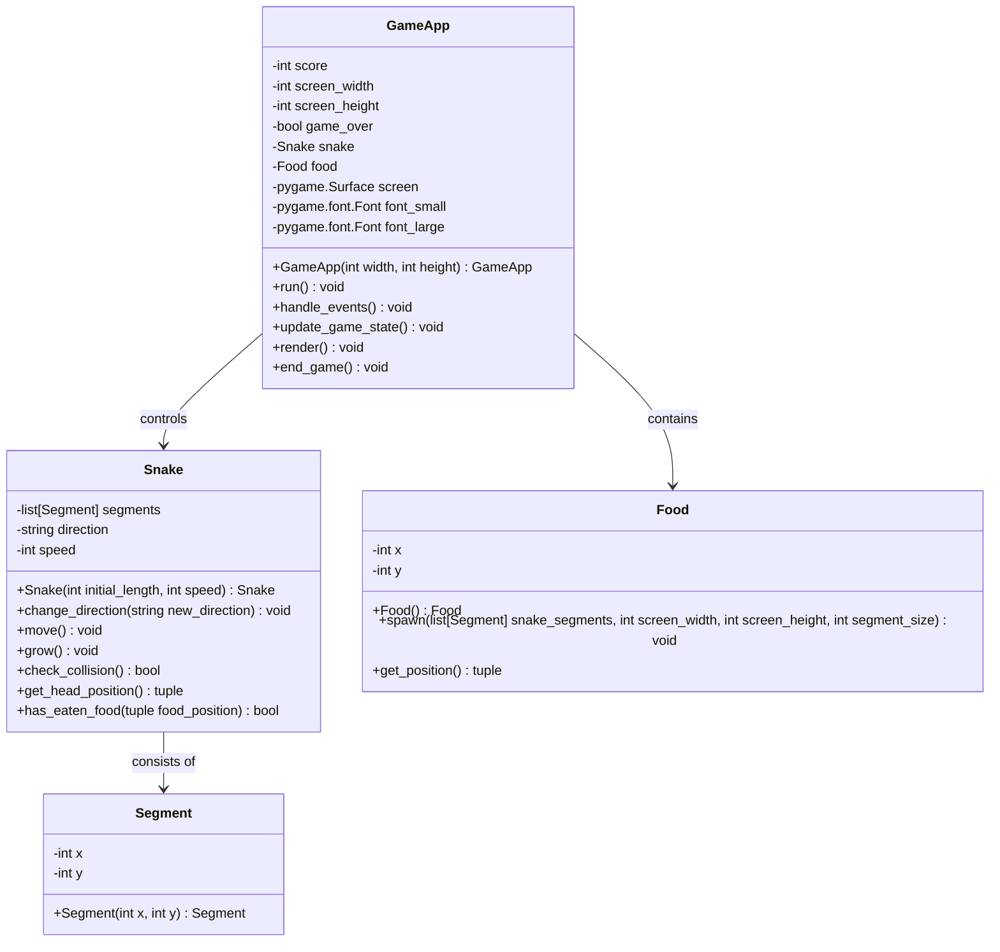

# Architecture
## Stack
Language: Python
Libraries:
  - pygame
  - random  # For generating random food positions

## Class diagram

This class diagram reflects the code provided, with the following updates and corrections:

1. The `spawn` method in the `Food` class now includes the `segment_size` parameter.
2. The `run` method in the `GameApp` class now includes a `pygame.time.Clock` instance, which is not represented in the class diagram as it is a local variable within the method.
3. The `handle_events` method in the `GameApp` class now includes logic to change the direction of the snake based on keyboard input, which is reflected in the `change_direction` method of the `Snake` class.
4. The `render` method in the `GameApp` class includes logic to draw the snake segments and food on the screen, as well as rendering the score text. These details are not represented in the class diagram as they are part of the method's internal logic.
5. The `end_game` method in the `GameApp` class now includes logic to display a 'Game Over' message and the final score, which is not represented in the class diagram as it is part of the method's internal logic.

The class diagram remains largely unchanged because it already accurately represents the structure of the classes and their relationships. The updates are primarily to the internal logic of methods, which are not typically detailed in class diagrams. Class diagrams focus on the classes, their attributes, methods, and the relationships between classes, rather than the implementation details of the methods.
This class diagram reflects the code provided, with the following updates:

- The `Snake` class now initializes the `direction` attribute with the string `'RIGHT'` instead of a generic string type.
- The `change_direction` method in the `Snake` class now includes logic to prevent changing to the opposite direction, which is not reflected in the class diagram as it is an implementation detail.
- The `move` method in the `Snake` class now creates a new `Segment` based on the current direction and speed, and adds it to the front of the `segments` list while removing the last segment to simulate movement.
- The `grow` method in the `Snake` class now adds a new `Segment` to the `segments` list based on the tail's position and the direction of growth.
- The `check_collision` method in the `Snake` class now checks for collisions between the head segment and the rest of the body.

The class diagram uses the correct snake_case naming convention and encapsulation principles. It is designed to be simple, avoiding unnecessary complexity, and follows the DRY principle. The design allows for a structured and modular codebase that is easy to navigate and update.
## File list
[game_app.py, snake.py, segment.py, food.py, main.py]

- main.py (contains Main class): This is the entry point of the application. It creates an instance of the GameApp class and starts the game by calling the run method.
- game_app.py (contains GameApp class): Manages the main game loop, event handling, rendering, and updating the game state. It also keeps track of the score, game over state, and contains instances of the Snake and Food classes.
- snake.py (contains Snake class): Represents the snake in the game, handling its movement, direction changes, growth, and collision detection. It also manages the list of Segment instances that make up the snake's body.
- segment.py (contains Segment class): Represents a single segment of the snake's body, holding its position on the screen.
- food.py (contains Food class): Represents the food object in the game. It is responsible for spawning in a new position that is not occupied by the snake and providing its current position.

## Common interface
### Routes
- No specific routes as this is a standalone game application.

### Variables and form
- `key_input`: A variable that captures the keyboard input from the player to control the snake's movement.
- `player_score`: A variable that represents the current score of the player, updated when the snake eats food.
- `game_state`: A variable that represents the current state of the game, including whether it is running or over.
- `snake_position`: A list of tuples representing the positions of each segment of the snake.
- `food_position`: A tuple representing the current position of the food.

### Dependencies
- main.py: Depends on game_app.py to initialize and start the game loop.
- game_app.py: Depends on snake.py for snake behavior, food.py for food behavior, and pygame for rendering and event handling.
- snake.py: Depends on segment.py for individual segment behavior and game_app.py for global game state.
- segment.py: No external dependencies, but provides interfaces for snake.py to control segment position.
- food.py: Depends on game_app.py for screen dimensions and snake.py for the snake's current position to avoid spawning on the snake.

### CSS classes
- No CSS classes as Pygame handles the graphical interface directly without using CSS.