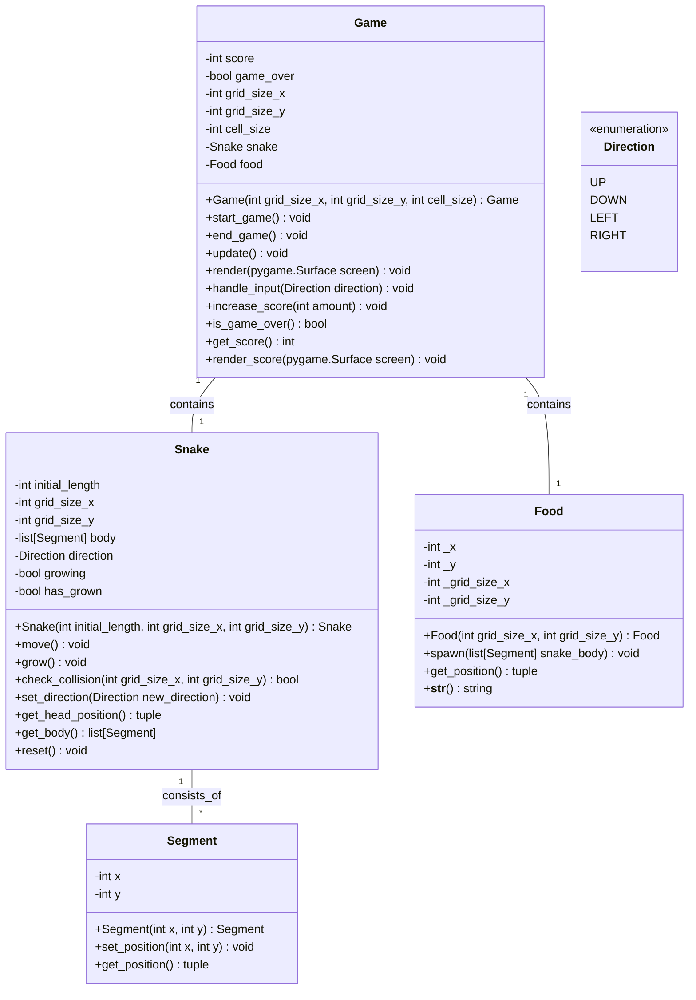

# Architecture
## Stack
```yaml
backend:
    languages: python
    libraries:
        - pygame
frontend: {}
```
## Class diagram


## Front-end design
The application does not require a front-end, render directly in the back-end using the suited library.

## File list
Here are the files that the development team will need to write for the implementation of the Serpentine Feast application, considering the provided technical stack and architecture:

- /app.py (contains Game class): This file is the entry point of the application. It includes the Game class which manages the game loop, rendering, and user input. It also contains the main function to initialize the game and start the game loop using Pygame.

- /entities/snake.py (contains Snake class): This file defines the Snake class that represents the snake in the game. It includes methods for moving the snake, growing it when it eats food, checking for collisions, and changing its direction.

- /entities/segment.py (contains Segment class): This file defines the Segment class that represents each segment of the snake's body. It includes methods to set and get the position of the segment.

- /entities/food.py (contains Food class): This file defines the Food class that represents the food object in the game. It includes methods to spawn food in a random location that is not occupied by the snake.

- /utilities/direction.py (contains Direction enumeration): This file defines the Direction enumeration that represents the possible directions the snake can move in the game.

Each of these files will contain the necessary class definitions and methods as outlined in the provided backend architecture. The use of Pygame will be integrated within these classes, particularly within the Game class for rendering and input handling, and the Food class for spawning food using Pygame's capabilities. The Snake and Segment classes will primarily deal with game logic and state management.

