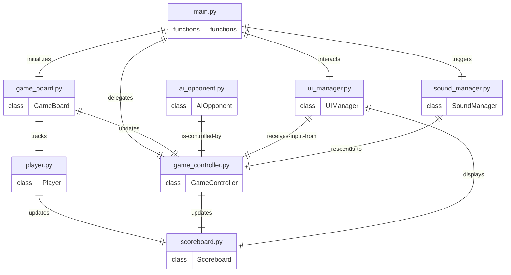

# Architecture
## Stack
```yaml
backend:
    languages: python
    libraries:
        - pygame
frontend:
    languages: python
    libraries:
        - pygame
```

## File list
- /main.py: This file is the entry point of the application. It initializes the game window, handles the game loop, processes user input for starting a new game, and delegates to other components like the game board and AI.

- /game_board.py: This file contains the GameBoard class that manages the game state, including the grid, player moves, and checking for win, loss, or draw conditions.

- /player.py: This file defines the Player class that represents a player in the game, storing their symbol (X or O), and their current score (wins, losses, and draws).

- /ai_opponent.py: This file includes the AIOpponent class that encapsulates the AI logic for making moves against the human player, providing at least a basic level of challenge.

- /ui_manager.py: This file contains the UIManager class that manages the user interface elements, such as drawing the game board, displaying the "New Game" button, and showing messages for win, loss, or draw.

- /sound_manager.py: This file defines the SoundManager class that handles playing sound effects when moves are made and when the game ends.

- /game_controller.py: This file includes the GameController class that coordinates the flow of the game, including turn-taking between players and the AI, and updating the game state after each move.

- /scoreboard.py: This file contains the Scoreboard class that manages the display and updating of the scoreboard, reflecting the number of wins, losses, and draws for each player.

## Roles
* `/main.py`:
    - Acts as the entry point of the application, initializing the game environment.
    - Contains the main game loop, handling user input and delegating tasks to other components.
    - Interacts with `/game_board.py` to initialize the game board, `/ui_manager.py` to manage UI interactions, `/game_controller.py` to delegate game flow control, and `/sound_manager.py` to trigger sound effects.
    - Instantiates classes from other files and integrates them to create a cohesive game experience.

* `/game_board.py`:
    - Contains the `GameBoard` class responsible for managing the game state.
    - Includes methods to handle player moves, check for win/loss/draw conditions, and reset the board.
    - Interacts with `/player.py` to track player moves and `/game_controller.py` to update the game state after each move.
    - The `GameBoard` class is instantiated by `/main.py` and is a central component of the game's logic.

* `/player.py`:
    - Defines the `Player` class representing a player in the game.
    - Stores player information such as symbol (X or O) and score (wins, losses, draws).
    - Interacts with `/scoreboard.py` to update the scoreboard with the player's current score.
    - Instances of the `Player` class are used by `/game_board.py` to track player moves and by `/game_controller.py` to manage turn-taking.

* `/ai_opponent.py`:
    - Includes the `AIOpponent` class encapsulating the AI logic for the game.
    - Provides methods for the AI to make moves autonomously, offering a basic level of challenge.
    - Controlled by `/game_controller.py`, which dictates when the AI should make a move.
    - The `AIOpponent` class is instantiated by `/main.py` when a single-player game is selected.

* `/ui_manager.py`:
    - Contains the `UIManager` class that manages all user interface elements.
    - Responsible for drawing the game board, displaying UI elements like the "New Game" button, and showing win/loss/draw messages.
    - Receives input from `/game_controller.py` to update the UI based on game state changes.
    - The `UIManager` class is instantiated by `/main.py` and is crucial for the user's interaction with the game.

* `/sound_manager.py`:
    - Defines the `SoundManager` class responsible for playing sound effects.
    - Includes methods to play sounds when moves are made and when the game ends.
    - Responds to events from `/game_controller.py`, which triggers the appropriate sound effects.
    - The `SoundManager` class is instantiated by `/main.py` and enhances the game experience with auditory feedback.

* `/game_controller.py`:
    - Includes the `GameController` class that coordinates the flow of the game.
    - Manages turn-taking between players and the AI, and updates the game state after each move.
    - Interacts with `/game_board.py` to update the board, `/ai_opponent.py` to control AI moves, `/ui_manager.py` to receive user input, `/sound_manager.py` to trigger sounds, and `/scoreboard.py` to update scores.
    - The `GameController` class is instantiated by `/main.py` and acts as the conductor of the game's operations.

* `/scoreboard.py`:
    - Contains the `Scoreboard` class that manages the scoreboard display and updates.
    - Keeps track of wins, losses, and draws for each player.
    - Interacts with `/player.py` to receive score updates and `/ui_manager.py` to display the scoreboard.
    - The `Scoreboard` class is instantiated by `/main.py` and provides players with a visual representation of their performance.

The technical stack for this application includes Python as the programming language and the Pygame library for creating the graphical user interface and handling user input. The design of the application is modular, with each file representing a distinct aspect of the game's functionality, and the classes within these files interacting with one another as defined by the ERD to create a seamless gameplay experience.

## Entity relationship diagram


This ERD represents the architecture of the Tic-Tac-Tactics application, showing the relationships between the different Python files (entities) that make up the application. Each entity represents a file that contains either functions or a single class, as per the rules provided. The relationships indicate how these files interact with each other within the application's design.

