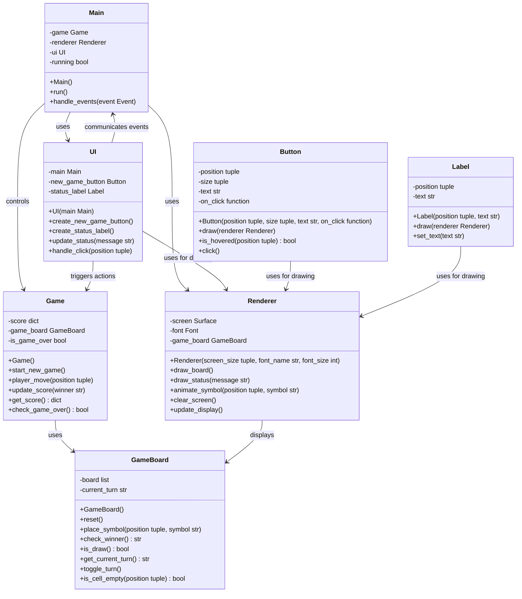

# Architecture and design

## Stack selection
Language: Python
Libraries: [pygame]
Description: Python is selected for its ease of use and rapid development capabilities. Pygame is a cross-platform set of Python modules designed for writing video games, providing the necessary functionality for rendering graphics, handling events, and creating game loops, making it an ideal choice for Tic-Tac-Toe Triumph.

## Design
The software design will consist of the following components:

1. **Main (App)**: Serves as the entry point and controller of the application, managing the game loop and event handling.
2. **GameBoard**: Represents the Tic-Tac-Toe board and manages the game state, including the placement of X's and O's, checking for wins or draws, and resetting the board.
3. **Renderer**: Handles all the rendering of the game board, symbols (X's and O's), and game status messages using Pygame.
4. **Game**: Manages high-level game logic, such as player turns, score tracking, and transitions between game states.
5. **UI**: Manages user interface elements such as buttons and messages, and handles user interactions.

## Class diagram

In this updated design, `Main` initializes the game and manages the game loop. `GameBoard` maintains the board state and checks for game outcomes. `Game` handles score and game flow. `Renderer` is responsible for all visual aspects. `UI` manages interface elements and user interactions, with `Button` and `Label` as components for interactive and display elements, respectively.

The class diagram has been updated to include UI-related classes and their relationships with existing components. The `Game` class now includes a method to check if the game is over (`check_game_over`). The `GameBoard` class includes a method to check if a cell is empty (`is_cell_empty`). The `Renderer` class now takes `GameBoard` as an argument to access the game state for rendering. The `UI` class acts as a mediator between user actions and game logic, with methods to create and handle UI elements. `Button` and `Label` classes are added to represent interactive and display elements on the screen, respectively.

Each class is designed to be implementable independently, with clear and meaningful names for variables, functions, and classes. The design follows the DRY principle to avoid code duplication and allows for a structured and modular codebase for easy navigation and updates.

## Files list
[game_board.py, renderer.py, button.py, label.py, game.py, ui.py, main.py]

- game_board.py (contains GameBoard class): This class represents the Tic-Tac-Toe board and is responsible for managing the game state. It handles the placement of X's and O's, checks for wins or draws, and resets the board when a new game starts.

- renderer.py (contains Renderer class): This class is responsible for rendering the game board, symbols (X's and O's), and game status messages. It uses the Pygame library to draw the graphical interface and animations.

- button.py (contains Button class): This class represents a button in the user interface. It is responsible for drawing the button, detecting hover and click events, and executing the associated callback function when the button is clicked.

- label.py (contains Label class): This class represents a text label in the user interface. It is responsible for drawing the text on the screen and updating the text content.

- game.py (contains Game class): This class manages high-level game logic, such as player turns, score tracking, and transitions between game states. It interacts with the GameBoard to process player moves and determine game outcomes.

- ui.py (contains UI class): This class manages the user interface elements, such as buttons and status messages. It handles user interactions and triggers actions in the game logic based on those interactions.

- main.py (contains Main class): This is the entry point of the application. It initializes the game, sets up the renderer and user interface, manages the game loop, and processes events. It coordinates the interaction between the game logic, rendering, and user interface.

## Common interface
### Routes
- No specific routes as this is a standalone game application.

### Variables and form
- `mouse_position`: A variable that captures the current position of the mouse cursor to detect cell selection and button clicks.
- `current_player`: A variable that represents the current player (X or O) whose turn it is to play.
- `game_board_state`: A variable that represents the current state of the game board, including the positions of X's and O's.
- `game_status_message`: A variable that represents the message to be displayed for the game status, such as "Player X's turn", "Player O wins!", or "It's a draw!".
- `new_game_triggered`: A boolean variable that indicates whether the "New Game" button has been clicked to reset the board and score.

### Dependencies
- main.py: Depends on game.py, renderer.py, and ui.py to manage the game loop, rendering, and user interactions.
- game_board.py: No external dependencies, but provides interfaces for game.py to manage the game state.
- renderer.py: Depends on pygame for rendering and game_board.py for accessing the game state. It is used by main.py to draw game elements on the screen.
- button.py and label.py: Depend on renderer.py to draw themselves on the screen.
- game.py: Depends on game_board.py to manage game logic such as turns and scoring. It is controlled by main.py and triggered by ui.py.
- ui.py: Depends on main.py for event handling, game.py for triggering game actions, and renderer.py for drawing UI elements. It also uses button.py and label.py for creating interactive and display elements.

### CSS classes
- No CSS classes as Pygame handles the graphical interface directly without using CSS. However, we can define styles for visual elements in terms of Pygame render methods:
  - `game_cell_style`: Defines the appearance of the cells on the game board.
  - `game_status_style`: Defines the appearance of the game status message, including font size, color, and alignment.
  - `button_style`: Defines the appearance of buttons in the UI, including font, size, color, and hover effects.
  - `winning_line_style`: Defines the appearance of the winning line animation when a player wins.
  - `draw_announcement_style`: Defines the appearance of the draw announcement when the game ends in a draw.