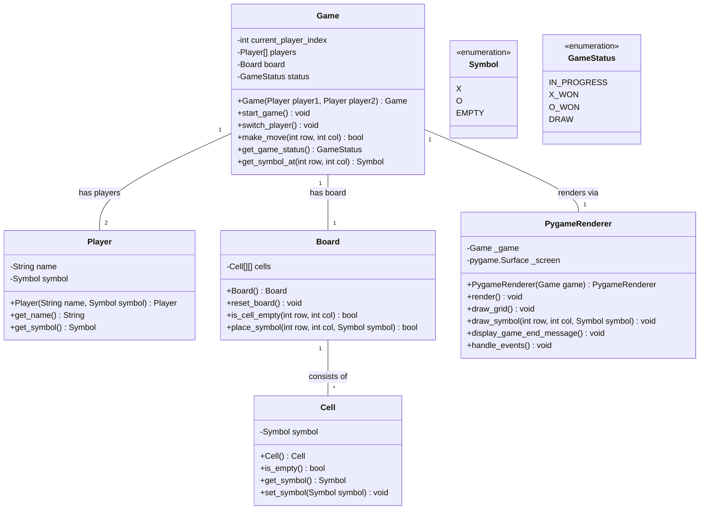

# Architecture
## Stack
```yaml
backend:
    languages: python
    libraries:
        - pygame
frontend:
    languages: python
    libraries: {}
```
## Class diagram


## Front-end design
The application does not require a front-end, render directly in the back-end using the suited library.

## File list
Here is the list of files that the development team will need to write for the implementation of the Tic-Tac-Toe Triumph application, following the provided technical stack and architecture:

- /app.py (contains the main entrypoint of the application): This file is the entry point of the Tic-Tac-Toe Triumph application. It initializes the game, sets up the Pygame environment, and starts the game loop. It will also handle the creation of the Game, Board, and Player instances and pass them to the PygameRenderer for rendering.

- /game.py (contains Game class): This file defines the Game class that manages the game state, including the current player, the board, and the game status. It includes methods to start the game, switch players, make moves, check for a winner or a draw, and retrieve the current game status.

- /player.py (contains Player class): This file defines the Player class that represents each player in the game. It includes methods to get and set the player's name and symbol.

- /board.py (contains Board class): This file defines the Board class that represents the game board. It includes methods to reset the board, check if a cell is empty, place a symbol on the board, and retrieve a cell's content.

- /cell.py (contains Cell class): This file defines the Cell class that represents each cell on the game board. It includes methods to determine if the cell is empty, get the cell's symbol, and set the cell's symbol.

- /pygame_renderer.py (contains PygameRenderer class): This file defines the PygameRenderer class that handles the rendering of the game using the Pygame library. It includes methods to render the game state, handle user events, and update the display.

- /symbol.py (contains Symbol enumeration): This file defines the Symbol enumeration that represents the possible symbols (X, O, EMPTY) that can be placed on the game board.

- /game_status.py (contains GameStatus enumeration): This file defines the GameStatus enumeration that represents the possible states of the game (IN_PROGRESS, X_WON, O_WON, DRAW).

Each of these files should be implemented with the corresponding class or enumeration as described, ensuring a modular and clean codebase that is compatible with the Python language and the Pygame library.

