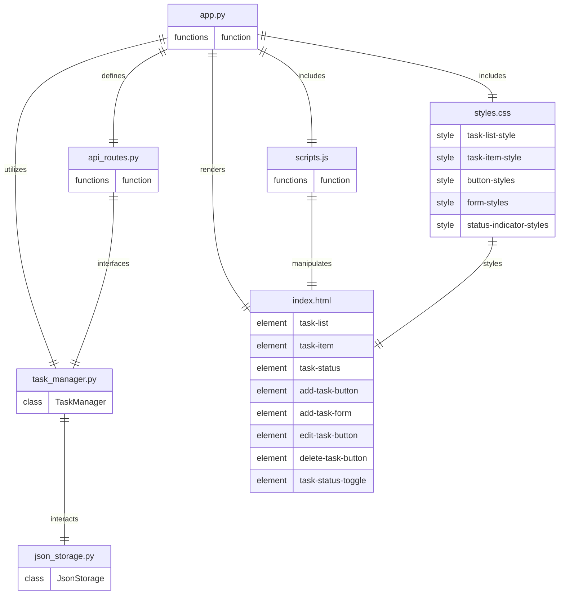

# Architecture
## Stack
```yaml
backend:
    languages: python
    libraries:
        - flask
frontend:
    languages:
        - javascript
        - css
        - html
    libraries:
        javascript: []
        css:
            - tailwindcss
        html: []
```

## File list
- /app.py: This file is the entry point of the Flask application. It sets up the Flask server, initializes routes for task operations like creating, updating, and deleting tasks, and handles server-side rendering.

- /task_manager.py: This file contains the TaskManager class that manages task-related operations, including adding new tasks, changing task statuses, deleting tasks, and persisting tasks to the JSON file.

- /json_storage.py: This file defines the JsonStorage class that handles reading from and writing to the JSON file, ensuring that tasks are stored and retrieved correctly.

- /templates/index.html: This file is the main HTML document that provides the structure of the web application's user interface. It includes placeholders for dynamically loaded content.

- /static/styles.css: This file includes the custom CSS styles for the application, utilizing TailwindCSS classes to ensure a responsive and visually appealing design.

- /static/scripts.js: This file contains the JavaScript code that manages client-side logic, such as handling user interactions, sending requests to the server to create, update, or delete tasks, and updating the UI in response to changes.

- /api_routes.py: This file defines the API routes for the Flask application, handling HTTP requests for tasks and interfacing with the TaskManager to perform operations.

Please note that the actual implementation might require additional utility files or modifications to this structure based on evolving project needs and developer preferences.

## Roles
* `/app.py`:
    - This file serves as the entry point for the Flask application.
    - It sets up the Flask server, initializes routes for task operations, and handles server-side rendering.
    - It utilizes the `TaskManager` class from `task_manager.py` to perform task-related operations.
    - It defines API routes by including `api_routes.py`.
    - It renders `index.html` to provide the structure of the web application's user interface.
    - It includes `styles.css` for custom CSS styles and `scripts.js` for client-side JavaScript logic.

* `/task_manager.py`:
    - Contains the `TaskManager` class that encapsulates the logic for managing tasks.
    - Provides methods to add new tasks, change task statuses, delete tasks, and persist tasks to the JSON file.
    - Interacts with the `JsonStorage` class from `json_storage.py` to handle the persistence of tasks.
    - An instance of `TaskManager` is used within `app.py` to integrate task management into the application's workflow.

* `/json_storage.py`:
    - Defines the `JsonStorage` class responsible for reading from and writing to the JSON file.
    - Ensures that tasks are stored and retrieved correctly, providing persistence for the application.
    - Interacts with the `TaskManager` class to save and load tasks as needed.
    - This class is instantiated by `TaskManager` to handle the storage aspect of task management.

* `/index.html`:
    - The main HTML document that provides the structure of the web application's user interface.
    - Includes placeholders for dynamically loaded content such as the task list, task items, and task statuses.
    - Interacts with `scripts.js` which manipulates its content through DOM manipulation.
    - Integrates styles from `styles.css` to style the HTML elements.

* `/styles.css`:
    - Includes custom CSS styles for the application, using TailwindCSS for a responsive and visually appealing design.
    - Defines styles for the task list, task items, buttons, forms, and status indicators.
    - Styles are applied to the elements defined in `index.html` to enhance the user interface.

* `/scripts.js`:
    - Contains the JavaScript code that manages client-side logic.
    - Handles user interactions, sends requests to the server to create, update, or delete tasks, and updates the UI in response to changes.
    - Manipulates the content of `index.html` by interacting with the DOM.
    - This script is included in `index.html` and is responsible for the dynamic behavior of the web application.

* `/api_routes.py`:
    - Defines the API routes for the Flask application.
    - Handles HTTP requests for tasks and interfaces with the `TaskManager` to perform operations.
    - This file is included in `app.py` to set up the API endpoints that the client-side JavaScript will interact with.

By following this structure, the application will be able to meet the user stories and requirements set by the product owner. The separation of concerns is clear, with each file having a distinct role, and the interactions between them are well-defined to facilitate a smooth development process and ensure the quality of the final product.

## Entity relationship diagram


This ERD represents the architecture of the TaskWave application, showing the relationships between the various code files. Each entity represents a file, and the relationships indicate how these files interact with each other. The ERD also includes the necessary HTML elements and CSS styles that need to be written to meet the user stories and requirements set by the product owner.

