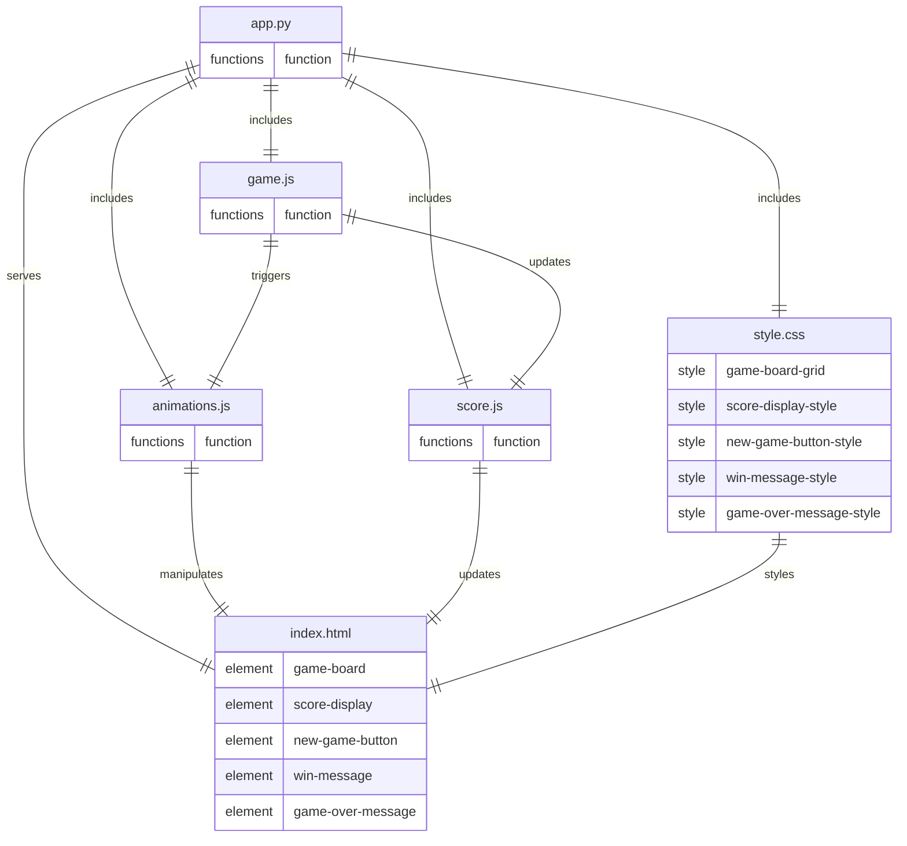

# Architecture
## Stack
```yaml
backend:
    languages: python
    libraries:
        - flask
frontend:
    languages:
        - javascript
        - css
        - html
    libraries: {}
```

## File list
Based on the provided context, here is a list of code files that will be written by the development team for the TileMaster 2048 application:

- `/app.py`: This file is the Flask application's entry point. It sets up the Flask server, defines routes for serving the game's HTML page, and handles any backend logic that may be required, such as serving static files.

- `/static/game.js`: This JavaScript file contains the core game logic for the frontend. It handles user input from keyboard arrow keys, tile movement and merging, win condition checking, and game over detection.

- `/static/animations.js`: This file manages the animations for the game. It includes functions to smoothly animate tile movements and merging, enhancing the visual experience as per the user stories.

- `/static/style.css`: This CSS file defines the styles for the game's user interface. It ensures that the game has a clean and modern look, with a grid layout for the tiles and visible areas for the score and game messages.

- `/templates/index.html`: This HTML file serves as the main template for the game. It includes the structure of the game's user interface, such as the game board, score display, "New Game" button, and placeholders for "You Win!" and "Game Over" messages.

- `/static/score.js`: This JavaScript file is responsible for managing the score display. It updates the score in real-time on the user interface as the player makes moves and combines tiles.


## Roles
Based on the provided context, here is a breakdown of the role of each file, their relationships, and the technical stack for the MergeMaster 2048 application:

* `/app.py`:
    - Serves as the Flask application's entry point.
    - Sets up the Flask server and defines routes for serving the game's HTML page and static files.
    - It includes the static JavaScript and CSS files, ensuring they are accessible to the client.
    - It does not contain game logic but may handle backend logic such as session management if required.

* `/static/game.js`:
    - Contains the core game logic for the frontend.
    - Handles user input, tile movement and merging, win condition checking, and game over detection.
    - Interacts with `/static/animations.js` to trigger animations during gameplay.
    - Updates the score display by interacting with `/static/score.js`.
    - It is included and executed in the client's browser, manipulating the DOM of `/templates/index.html`.

* `/static/animations.js`:
    - Manages animations for the game.
    - Includes functions to animate tile movements and merging.
    - It is triggered by `/static/game.js` during gameplay to enhance the visual experience.
    - Directly manipulates the DOM elements of `/templates/index.html` to show animations.

* `/static/style.css`:
    - Defines the styles for the game's user interface.
    - Ensures a clean and modern look with a grid layout for the tiles and styled score and game message areas.
    - It is included in `/templates/index.html` and applies styles to the HTML elements.

* `/templates/index.html`:
    - Serves as the main template for the game's user interface.
    - Includes the structure for the game board, score display, "New Game" button, and game messages.
    - Content is manipulated by `/static/game.js`, `/static/animations.js`, and `/static/score.js` through DOM manipulation.
    - Styles are applied from `/static/style.css`.

* `/static/score.js`:
    - Responsible for managing the score display.
    - Updates the score in real-time on the user interface as the player makes moves and combines tiles.
    - It is included and executed in the client's browser, interacting with the DOM of `/templates/index.html` to update the score.


## Entity relationship diagram



