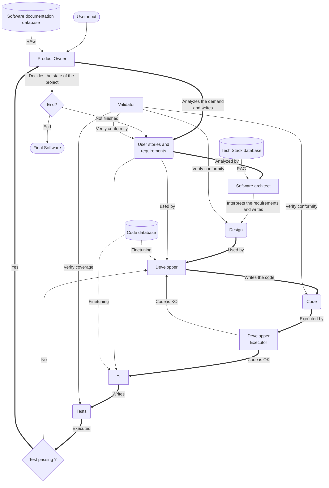
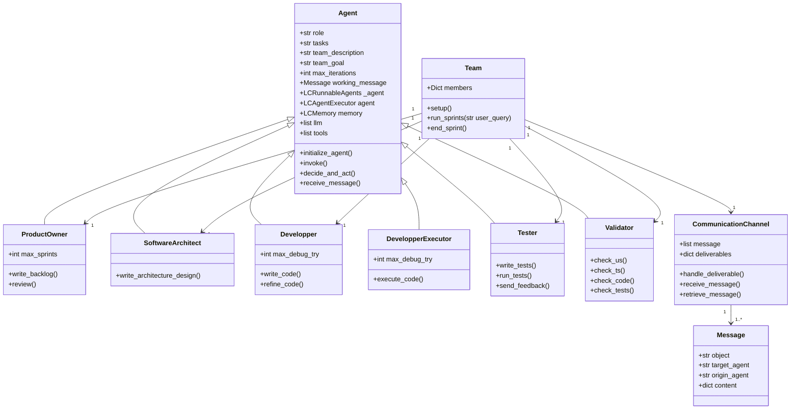
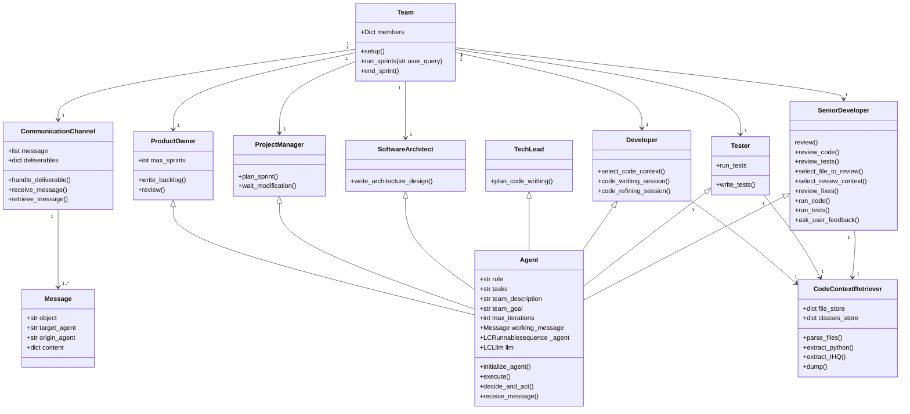

## Flowchart 
Here you can view the flowchart that illustrates the inner processes behind the application.

```mermaid
flowchart TD
    %% Requirements generation
    User(["User input"]) --> PO["Product Owner"]
    PO ==> |"Analyzes the demand \n and writes"| US("User stories and \n requirements")

    %% tech stack generation
    US ==> |"Analyzed by"| SA["Software architect"]
    SA --> |"Interprets the requirements and writes"| TC("Design")

    %% Code generation
    TC ==> |Used by| Dev[Developper]
    Dev ==> |"Writes the code"| Code("Code")
    US --> |used by| Dev

    %% Code execution and feedback
    Code ==> |Executed by| Exec["Developper\nExecutor"]
    Exec ==> |Code is OK| Tt
    Exec --> |Code is KO| Dev

    %% Tests generation
    US --> Tt
    Tt ==> |Writes| tests("Tests")
    tests ==> |Executed| TB{"Test passing ?"}
    TB --> |No| Dev
    TB ==> |Yes| PO

    PO --> |Decides the state of the project| State{End?}
    State -->|Not finished| US
    State --> |End| Product([Final Software])
    
    %% Looping
    SM["Validator"] --> |Verify conformity| US
    SM --> |Verify conformity| TC
    SM --> |Verify conformity| Code
    SM --> |Verify coverage| tests

    %% Databases
    Data1[("Software documentation database")] -.-> |RAG| PO
    Data2[("Tech Stack database")] -.-> |RAG| SA
    Data3[("Code database")] -.-> |Finetuning| Dev
    Data3 -.-> |Finetuning|Tt
```

## Class diagram

```mermaid
classDiagram
    class Agent{
        +str role
        +str tasks
        +str team_description
        +str team_goal
        
        +int max_iterations
        +Message working_message
        
        +LCRunnableAgents _agent
        +LCAgentExecutor agent
        +LCMemory memory
        +list llm
        +list tools

        +initialize_agent()
        +invoke()
        +decide_and_act()
        +receive_message()

    }


    Agent <|-- ProductOwner
    class ProductOwner{
        +int max_sprints

        +write_backlog()
        +review()
    }

    Agent <|-- SoftwareArchitect
    class SoftwareArchitect{
        +write_architecture_design()
    }

    Agent <|-- Developper
    class Developper{
        +int max_debug_try

        +write_code()
        +refine_code()
    }

    Agent <|-- DevelopperExecutor
    class DevelopperExecutor{
        +int max_debug_try

        +execute_code()
    }

    Agent <|-- Tester
    class Tester{
        +write_tests()
        +run_tests()
        +send_feedback()
    }

    Agent <|-- Validator
    class Validator{
        +check_us()
        +check_ts()
        +check_code()
        +check_tests()
    }

    Team "1" --> "1" ProductOwner
    Team "1" --> "1" SoftwareArchitect
    Team "1" --> "1" Developper
    Team "1" --> "1" Tester
    Team "1" --> "1" Validator
    class Team{
        +Dict members

        +setup()
        +run_sprints(str user_query)
        +end_sprint()
    }
    
    Team "1" --> "1" CommunicationChannel
    class CommunicationChannel{
        +list message
        +dict deliverables

        +handle_deliverable()
        +receive_message()
        +retrieve_message()
        
    }

    CommunicationChannel "1" --> "1..*" Message
    class Message{
        +str object
        +str target_agent
        +str origin_agent
        +dict content
    } 
```

```mermaid
classDiagram

    class CodeContextRetriever {
        +dict file_store
        +dict classes_store
        +parse_files()
        +extract_python()
        +extract_IHQ()
        +dump()
    }

    class Agent {
        +str role
        +str tasks
        +str team_description
        +str team_goal
        +int max_iterations
        +Message working_message
        +LCRunnablesequence _agent
        +LCLllm llm

        +initialize_agent()
        +execute()
        +decide_and_act()
        +receive_message()
    }

    class ProductOwner {
        +int max_sprints

        +write_backlog()
        +review()
    }

    class ProjectManager {
        +plan_sprint()
        +wait_modification()
    }

    class SoftwareArchitect {
        +write_architecture_design()
    }

    class TechLead {
        +plan_code_writting()
    }

    class Developer {
        +select_code_context()
        +code_writting_session()
        +code_refining_session()
    }

    class SeniorDeveloper{
    review()
    +review_code()
    +review_tests()
    +select_file_to_review()
    +select_review_context()
    +review_fixes()
    +run_code()
    +run_tests()
    +ask_user_feedback()
    }

    class Tester {
        +write_tests()
        +run_tests
        }

    ProductOwner <|-- Agent
    ProjectManager <|-- Agent
    SoftwareArchitect <|-- Agent
    TechLead <|-- Agent
    Developer <|-- Agent
    Tester <|-- Agent
    SeniorDeveloper <|-- Agent


    class Team{
        +Dict members

        +setup()
        +run_sprints(str user_query)
        +end_sprint()
    }
    
    Team "1" --> "1" CommunicationChannel
    class CommunicationChannel{
        +list message
        +dict deliverables

        +handle_deliverable()
        +receive_message()
        +retrieve_message()
        
    }

    CommunicationChannel "1" --> "1..*" Message
    class Message{
        +str object
        +str target_agent
        +str origin_agent
        +dict content
    }

    

    
    Team "1" --> "1" ProductOwner
    Team "1" --> "1" SoftwareArchitect
    Team "1" --> "1" Developer
    Team "1" --> "1" SeniorDeveloper
    Team "1" --> "1" ProjectManager
    Team "1" --> "1" Tester

    Developer "1" --> "1" CodeContextRetriever
    Tester "1" --> "1" CodeContextRetriever
    SeniorDeveloper "1" --> "1" CodeContextRetriever
    
    
```
