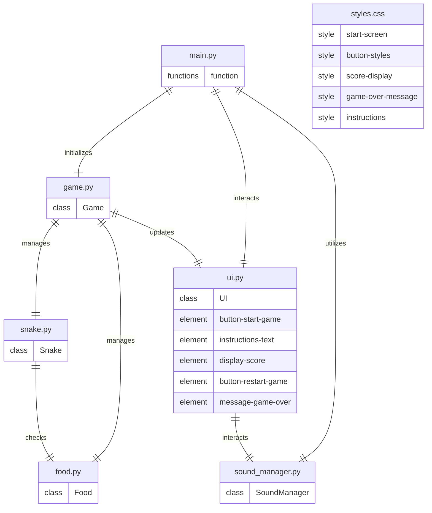

# Architecture
## Stack
```yaml
backend:
    languages: python
    libraries:
        - pygame
frontend:
    languages:
        -   javascript
        -   css
        -   html
    libraries:
        javascript:
            - axios
        css:
            - tailwind
        html:
            - bootstrap
```

## File list
- /main.py: This file is the entry point of the application. It initializes the Pygame library, sets up the game window, and manages the main game loop, including handling user input for starting a new game and controlling the snake's movement.

- /game.py: This file contains the Game class that manages the overall game state, including the snake's position, food placement, score tracking, and game over conditions. It also handles the logic for growing the snake when it eats food and checking for collisions with walls or itself.

- /snake.py: This file defines the Snake class that represents the snake's structure and behavior. It includes methods for moving the snake, growing its length, and checking for collisions with itself.

- /food.py: This file contains the Food class that manages the food's position on the game board. It includes methods for generating a new food position and checking if the snake has eaten the food.

- /ui.py: This file includes the UI class that manages the user interface elements, such as drawing the start screen, displaying the score, and showing the "Game Over" message. It also handles the rendering of the "Restart Game" button after a game ends.

- /sound_manager.py: This file defines the SoundManager class that handles all sound effects in the game, including playing sounds when the snake eats food and when the game ends. It ensures that sound effects are played at the appropriate times during gameplay.

## Roles
* `main.py`:
    - serves as the entry point of the application.
    - initializes the Pygame library and sets up the game window.
    - manages the main game loop, including handling user input for starting a new game and controlling the snake's movement.
    - interacts with the `ui.py` to display the start screen and game over messages.
    - utilizes the `sound_manager.py` to play sound effects during the game.

* `game.py`:
    - contains the `Game` class that manages the overall game state.
    - tracks the snake's position, food placement, score, and game over conditions.
    - handles the logic for growing the snake when it eats food and checking for collisions with walls or itself.
    - integrates the `Snake` class to manage the snake's behavior and the `Food` class to manage food placement.
    - updates the UI through the `ui.py` to reflect the current score and game state.

* `snake.py`:
    - defines the `Snake` class that represents the snake's structure and behavior.
    - includes methods for moving the snake, growing its length, and checking for collisions with itself.
    - interacts with the `Food` class to check if the snake has eaten food, triggering growth.

* `food.py`:
    - contains the `Food` class that manages the food's position on the game board.
    - includes methods for generating a new food position and checking if the snake has eaten the food.
    - interacts with the `Snake` class to determine if the snake's head has collided with the food.

* `ui.py`:
    - includes the `UI` class that manages user interface elements.
    - handles drawing the start screen, displaying the score, and showing the "Game Over" message.
    - manages the rendering of the "Restart Game" button after a game ends.
    - interacts with the `sound_manager.py` to play sound effects when necessary.

* `sound_manager.py`:
    - defines the `SoundManager` class that handles all sound effects in the game.
    - includes methods for playing sounds when the snake eats food and when the game ends.
    - ensures that sound effects are played at the appropriate times during gameplay, integrating with the `ui.py` for user feedback.

This structure ensures that each component has a clear role and interacts effectively with others, facilitating a smooth implementation and maintaining the quality of the final product.

## Entity relationship diagram


