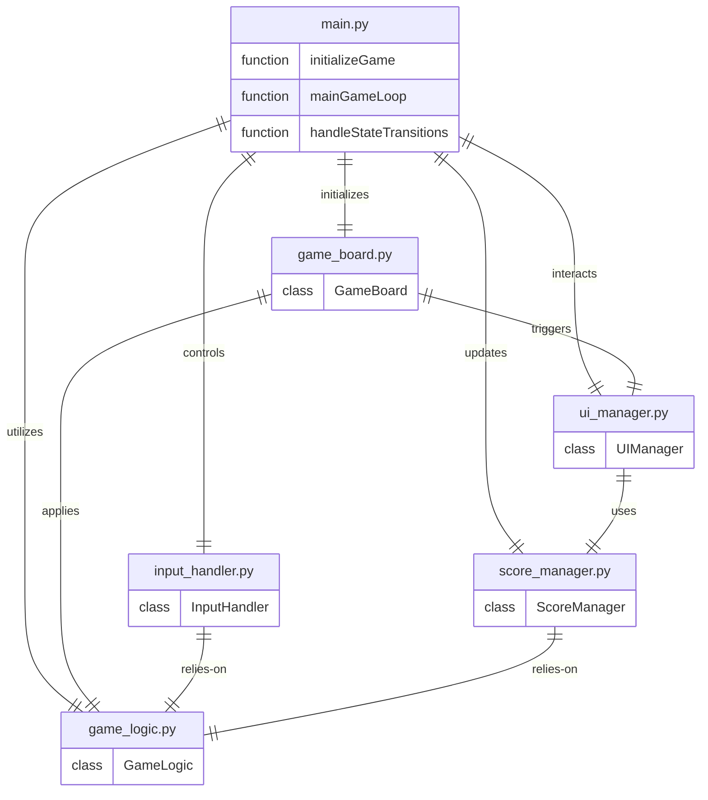

# Architecture
## Stack
```yaml
backend:
    languages: python
    libraries:
        - pygame
frontend:
    languages:
        - python # Since Pygame handles both the game logic and the UI, no separate frontend languages are needed.
    libraries: {} # No additional libraries are needed for the frontend as Pygame provides the necessary functionality.
```

## File list
Based on the provided context, here is a list of code files that will be written by the development team for the MergeMaster 2048 application:

- `/main.py`: This file is the entry point of the application. It initializes the game environment using Pygame, handles the main game loop, processes user input for game controls, and manages transitions between game states (e.g., starting a new game, winning, or losing).

- `/game_board.py`: This file contains the `GameBoard` class that manages the game state. It includes the grid representation, tile placement, and the logic for moving and merging blocks according to user input.

- `/game_logic.py`: This file defines the `GameLogic` class that encapsulates the rules of the game. It handles valid move determination, random tile generation after each move, win condition checks (creating a 2048 block), and game over checks (no valid moves possible).

- `/ui_manager.py`: This file includes the `UIManager` class responsible for managing all user interface elements. It handles drawing the game board, displaying the current score, and rendering messages such as "You Win!" or "Game Over". It also ensures the interface is intuitive and suitable for both desktop and mobile devices.

- `/score_manager.py`: This file defines the `ScoreManager` class that is responsible for calculating and updating the score. It tracks the sum of all numbers generated from merging blocks and updates the score display in real-time with each valid move.

- `/input_handler.py`: This file contains the `InputHandler` class that abstracts the user input, translating keyboard swipes or arrow key presses into game actions. It ensures that all blocks move in the intended direction with a single input.

These files encapsulate the main features and responsibilities required to implement the MergeMaster 2048 application according to the user stories and product owner's requirements. Each class is designed to have a single responsibility, promoting a clean and maintainable codebase.

## Roles
Based on the provided context, here is a detailed description of each file and class within the MergeMaster 2048 application, including their roles, relationships, and how they integrate with each other:

* `/main.py`:
    - Acts as the entry point of the application.
    - Initializes the game environment using Pygame and sets up the main game loop.
    - Handles state transitions such as starting a new game, winning, or losing.
    - Integrates with `game_board.py` to initialize the game board.
    - Utilizes `game_logic.py` to process game rules and logic.
    - Interacts with `ui_manager.py` to manage user interface updates.
    - Controls the flow of user input through `input_handler.py`.
    - Updates the score by communicating with `score_manager.py`.

* `/game_board.py`:
    - Contains the `GameBoard` class that manages the game state.
    - Manages the grid representation and tile placement.
    - Applies game logic from `game_logic.py` to move and merge blocks.
    - Triggers updates to the user interface through `ui_manager.py`.
    - Integrated into `main.py` to be initialized and updated during the game loop.

* `/game_logic.py`:
    - Defines the `GameLogic` class that encapsulates the rules of the game.
    - Handles valid move determination and random tile generation.
    - Checks for win conditions (creating a 2048 block) and game over conditions.
    - Relies on `input_handler.py` to receive user actions and apply game rules.
    - Relies on `score_manager.py` to update the score after block merges.
    - Integrated into `main.py` for game rule processing and into `game_board.py` for applying logic to the game state.

* `/ui_manager.py`:
    - Includes the `UIManager` class responsible for managing all user interface elements.
    - Handles drawing the game board and displaying the current score.
    - Renders messages such as "You Win!" or "Game Over".
    - Ensures the interface is intuitive and suitable for both desktop and mobile devices.
    - Uses `score_manager.py` to display the updated score.
    - Integrated into `main.py` to manage UI updates in response to game state changes.

* `/input_handler.py`:
    - Contains the `InputHandler` class that abstracts the user input.
    - Translates keyboard swipes or arrow key presses into game actions.
    - Relies on `game_logic.py` to determine the outcome of user inputs.
    - Integrated into `main.py` to control the flow of user input into the game.

* `/score_manager.py`:
    - Defines the `ScoreManager` class responsible for calculating and updating the score.
    - Tracks the sum of numbers generated from merging blocks.
    - Updates the score display in real-time with each valid move.
    - Relies on `game_logic.py` to determine when blocks merge and to calculate the score.
    - Integrated into `main.py` to update the score and into `ui_manager.py` to display the score.

The technical stack for this application consists of Python and Pygame, as specified by the product owner. Python is used for the overall development of the game logic, user interface, and input handling, while Pygame provides the necessary tools for rendering graphics, handling events, and managing the game loop.

The application is designed to be simple and intuitive, with a focus on ease of navigation and gameplay on both desktop and mobile devices. The separation of concerns is evident in the modular design of the codebase, where each file and class has a specific responsibility, promoting maintainability and scalability of the application.

## Entity relationship diagram


In this ERD, each entity represents a file of the application, and the relationships between them indicate how they interact with each other. The `main.py` file acts as the entry point and orchestrates the flow of the game by initializing the game environment and handling the main game loop and state transitions. It interacts with all other components to control the game's logic, user interface, input handling, and score management.

The `game_board.py` file contains the `GameBoard` class, which is responsible for managing the game state, including the grid and tile placement. It applies the game logic and triggers updates to the user interface.

The `game_logic.py` file defines the `GameLogic` class, encapsulating the rules of the game, such as move determination, tile generation, win condition checks, and game over checks.

The `ui_manager.py` file includes the `UIManager` class, which manages all user interface elements, uses the `ScoreManager` to display the score, and ensures the interface is suitable for both desktop and mobile devices.

The `input_handler.py` file contains the `InputHandler` class, which abstracts user input and relies on the `GameLogic` to translate inputs into game actions.

Lastly, the `score_manager.py` file defines the `ScoreManager` class, which calculates and updates the score based on the game logic's merging of blocks.

This ERD does not include HTML or CSS files as the game is developed with Python and Pygame, which handles rendering within the application itself rather than through a web interface.

