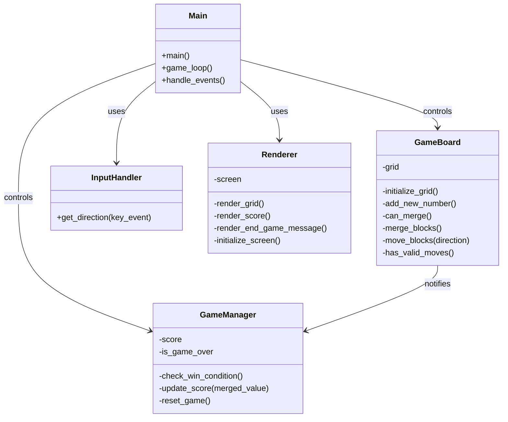

# Architecture and design
## Stack selection
Language: Python
Libraries: [pygame, random]
Description: Python for the core game logic, Pygame for rendering the game interface, and the random library for generating random numbers.

## Design
The software design will consist of the following components:
1. Main or App: This class will be the entry point of the application, handling the game loop, event processing, and game state transitions.
2. GameBoard: This class will represent the 10x10 game grid and will manage the placement of numbers, merging of blocks, and checking for available moves.
3. GameManager: This class will manage the game state, including the score, win/loss conditions, and triggering the addition of new numbers to the board.
4. InputHandler: This component will handle user input from the arrow keys and translate them into game actions.
5. Renderer: This component will handle the rendering of the game board, score, and end-game messages using Pygame.

## Class diagram

## Files list
[main.py, game_board.py, game_manager.py, input_handler.py, renderer.py]

- main.py (contains Main class): Initializes the game and runs the main game loop, handling events and rendering.
- game_board.py (contains GameBoard class): Manages the game grid, including block placement, merging, and movement.
- game_manager.py (contains GameManager class): Manages the game state, score, win/loss conditions, and game resets.
- input_handler.py (contains InputHandler class): Handles user input and translates it into game actions.
- renderer.py (contains Renderer class): Handles all rendering tasks using Pygame, including the game board, score, and end-game messages.

## Common interface
### Routes
- No specific routes as this is a standalone game application.

### Variables and form
- `direction`: A variable that represents the direction of the move based on the arrow key pressed.
- `score`: A variable that represents the current score of the game.
- `grid`: A variable that represents the 10x10 game grid.

### Dependencies
- main.py: Depends on GameBoard (game_board.py), GameManager (game_manager.py), InputHandler (input_handler.py), and Renderer (renderer.py) to run the game.
- game_board.py: Depends on random library to add new numbers and GameManager (game_manager.py) to notify about merges and moves.
- game_manager.py: No external dependencies.
- input_handler.py: No external dependencies.
- renderer.py: Depends on Pygame for rendering.

### CSS classes
- No CSS classes as Pygame handles the graphical interface directly without using CSS.